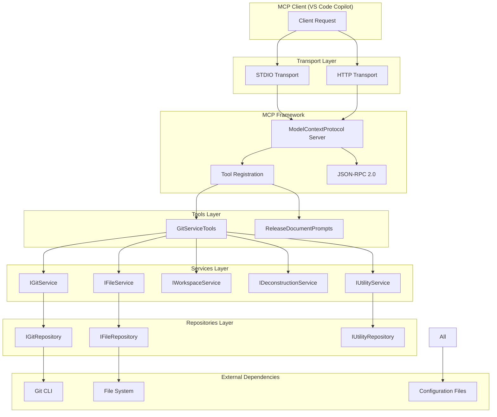
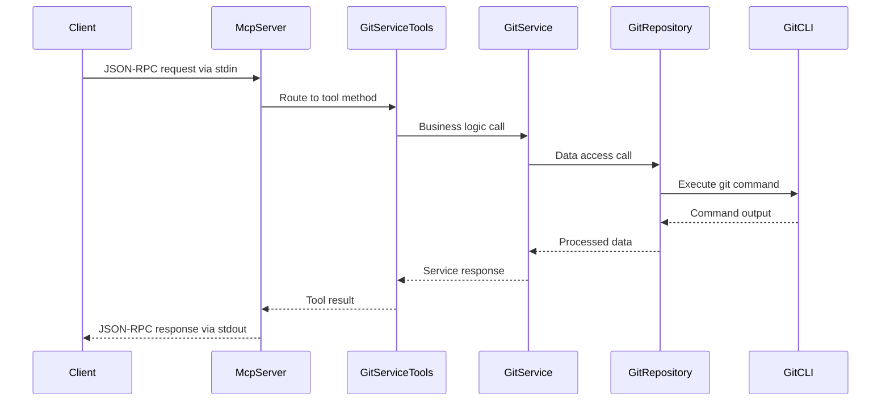
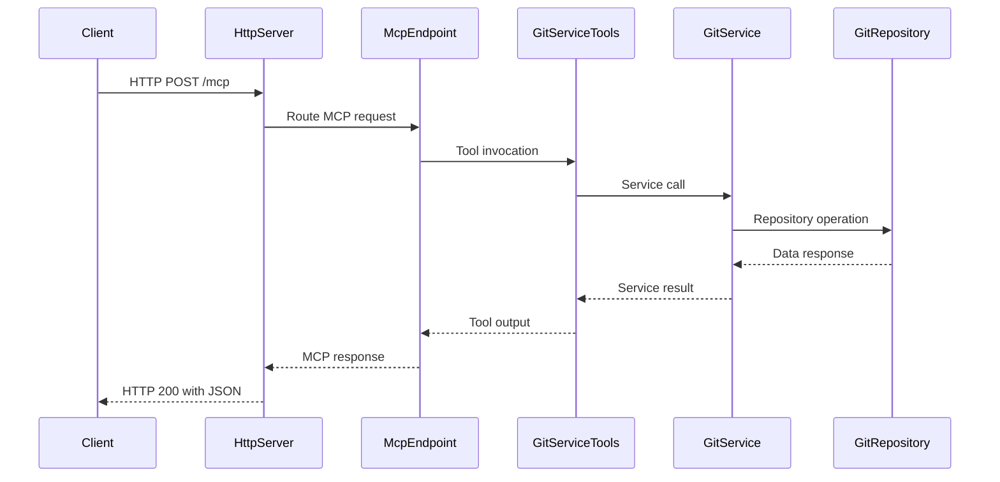

# GitVisionMCP 1.0.8.2 Architecture

**Release Branch:** origin/master | **Current Branch:** remove_handler

## Overview

GitVisionMCP is a Model Context Protocol (MCP) server implementation that provides Git-based documentation generation and repository analysis tools. The application is built using C# and the ASP.NET Core framework, designed to operate in both STDIO and HTTP transport modes. It serves as a bridge between Git repositories and MCP clients (such as VS Code Copilot) by exposing Git operations and file system analysis capabilities through standardized MCP tool interfaces.

The architecture follows a layered approach with clear separation of concerns: MCP framework integration, tools layer, services layer, and repositories layer. The application supports dynamic transport configuration through environment variables and provides comprehensive logging, configuration management, and file watching capabilities.

## Architectural Relationship



## Component Responsibilities

### MCP Framework Integration

- **Transport Management**: Configurable STDIO/HTTP transport based on `GITVISION_MCP_TRANSPORT` environment variable
- **Tool Registration**: Automatic discovery and registration of tools decorated with `[McpServerToolAttribute]`
- **JSON-RPC 2.0**: Protocol compliance for client-server communication
- **Lifecycle Management**: Graceful startup, shutdown, and error handling

### GitServiceTools (Primary Tool Interface)

The main MCP tool class implementing `IGitServiceTools` with 30+ exposed tools:

**Git Operations:**

- `gv_generate_git_commit_report`: Generate documentation from git logs
- `gv_compare_branches_documentation`: Compare differences between branches
- `gv_compare_commits_documentation`: Compare differences between commits
- `gv_get_recent_commits`: Retrieve recent commit information
- `gv_get_current_branch`: Get active branch name
- `gv_fetch_from_remote`: Fetch latest changes from remote

**File System Operations:**

- `gv_list_workspace_files`: List and filter workspace files
- `gv_read_filtered_workspace_files`: Read contents of filtered files
- `gv_search_json_file`: JSONPath queries on JSON files
- `gv_search_xml_file`: XPath queries on XML files
- `gv_search_yaml_file`: JSONPath queries on YAML files
- `gv_search_csv_file`: JSONPath queries on CSV files
- `gv_search_excel_file`: JSONPath queries on Excel files

**Analysis Operations:**

- `gv_deconstruct_to_file`: Analyze C# file structure
- `gv_git_find_merge_conflicts`: Detect Git merge conflicts
- `gv_get_app_version`: Extract application version information

### Services Layer

Provides business logic and orchestration:

- **IGitService**: Git operations, commit analysis, branch management, diff generation
- **IFileService**: File system operations, content reading, workspace analysis
- **IWorkspaceService**: Project structure analysis, configuration management
- **IDeconstructionService**: C# code analysis and structure extraction
- **IUtilityService**: Helper functions, version extraction, utility operations

### Repositories Layer

Handles direct data access and external system integration:

- **IGitRepository**: Direct Git CLI interactions, repository operations
- **IFileRepository**: File system access, directory traversal, content reading
- **IUtilityRepository**: Configuration access, utility data operations

## Transport-Specific Behavior

### STDIO Transport Sequence



### HTTP Transport Sequence



## Tool Discovery and Registration

The MCP framework automatically discovers tools through:

1. **Attribute-Based Registration**: Classes decorated with `[McpServerToolType]`
2. **Method Discovery**: Public methods decorated with `[McpServerToolAttribute]`
3. **Dependency Injection**: Automatic resolution of service dependencies
4. **Runtime Registration**: Dynamic tool availability based on configuration

Example tool registration in `Program.cs`:

```csharp
builder.Services.AddMcpServer().WithStdioServerTransport()
    .WithTools<GitServiceTools>()
    .WithPrompts<ReleaseDocumentPrompts>();
```

## Configuration Logic

### Environment-Based Transport Selection

```csharp
var transportType = Environment.GetEnvironmentVariable("GITVISION_MCP_TRANSPORT") ?? "unset";
switch (transportType.ToLowerInvariant())
{
    case "http": /* HTTP configuration */
    case "stdio": /* STDIO configuration */
    default: /* Default to STDIO */
}
```

### Dynamic Configuration Reloading

- **File Watching**: Monitors `.gitvision/config.json` for changes
- **Debounced Reloading**: 250ms debounce to prevent excessive reloads
- **Graceful Fallback**: Maintains last-good configuration on reload failures
- **Service Integration**: Configuration changes propagate to all dependent services

### Logging Configuration

- **Serilog Integration**: Structured logging with file rotation
- **Environment-Specific Levels**: Configurable log levels and outputs
- **Performance Monitoring**: Request/response timing and error tracking

## Repository Pattern Architecture

### Benefits Realized

1. **Separation of Concerns**: Clear distinction between business logic (Services) and data access (Repositories)
2. **Testability**: Repository interfaces enable easy unit testing with mocks
3. **Flexibility**: Repository implementations can be swapped without affecting services
4. **Consistency**: Standardized data access patterns across all operations

### Pattern Implementation

```csharp
// Service depends on repository interface
public class GitService : IGitService
{
    private readonly IGitRepository _gitRepository;

    public GitService(IGitRepository gitRepository)
    {
        _gitRepository = gitRepository;
    }
}

// Repository handles actual Git CLI interactions
public class GitRepository : IGitRepository
{
    public async Task<List<GitCommitInfo>> GetGitLogsAsync(string repositoryPath, int maxCommits)
    {
        // Direct Git CLI interaction
    }
}
```

## Key Differences Summary

| Component           | Responsibility                            | Technology                  | Interaction Pattern      |
| ------------------- | ----------------------------------------- | --------------------------- | ------------------------ |
| **MCP Framework**   | Protocol compliance, transport management | ModelContextProtocol.Server | JSON-RPC 2.0             |
| **GitServiceTools** | Tool interface, parameter validation      | MCP Attributes              | Direct client exposure   |
| **Services**        | Business logic, orchestration             | Dependency injection        | Interface-based          |
| **Repositories**    | Data access, external system calls        | Process execution           | Command-line integration |
| **Transport Layer** | Client communication                      | STDIO/HTTP                  | Protocol-specific        |

## Redundancy Analysis

### Configuration Management

- **Primary**: `.gitvision/config.json` file-based configuration
- **Fallback**: Environment variables and hard-coded defaults
- **Reload Strategy**: File watching with debounced updates

### Error Handling

- **Tool Level**: Parameter validation and business rule enforcement
- **Service Level**: Exception handling and logging
- **Repository Level**: External command failure recovery
- **Transport Level**: Protocol error responses and client disconnection handling

### Resource Management

- **File System**: Automatic directory creation and permission handling
- **Process Management**: Git CLI process lifecycle and timeout handling
- **Memory Management**: Large file filtering and content size limits

## Best Practices Observed

1. **Interface Segregation**: Each service interface focuses on a specific domain area
2. **Dependency Injection**: All dependencies injected through constructor parameters
3. **Async/Await Pattern**: Consistent asynchronous operation handling
4. **Structured Logging**: Comprehensive logging with contextual information
5. **Parameter Validation**: Input validation at tool boundaries
6. **Exception Propagation**: Proper exception handling and error context preservation
7. **Resource Cleanup**: Proper disposal of file system watchers and processes
8. **Configuration Validation**: Graceful handling of invalid configuration states

## Conclusion

GitVisionMCP implements a robust, scalable architecture that successfully bridges Git repository operations with MCP protocol requirements. The layered design ensures maintainability while the repository pattern provides flexibility for future enhancements. The dual transport support (STDIO/HTTP) makes the application suitable for various deployment scenarios, from local development tools to server-based integrations.

The architecture's strength lies in its clear separation of concerns, comprehensive error handling, and extensible design that allows for easy addition of new tools and capabilities without disrupting existing functionality.
