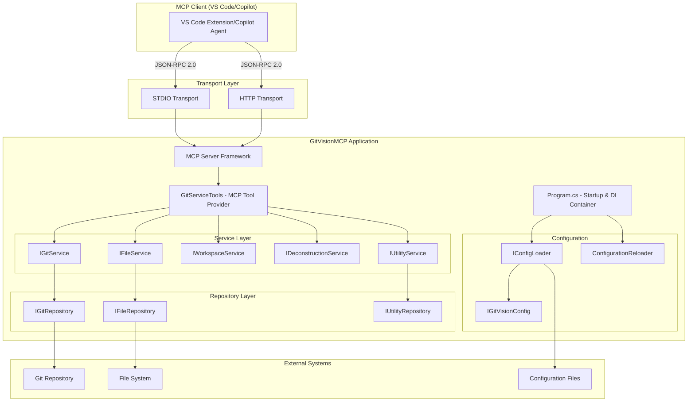
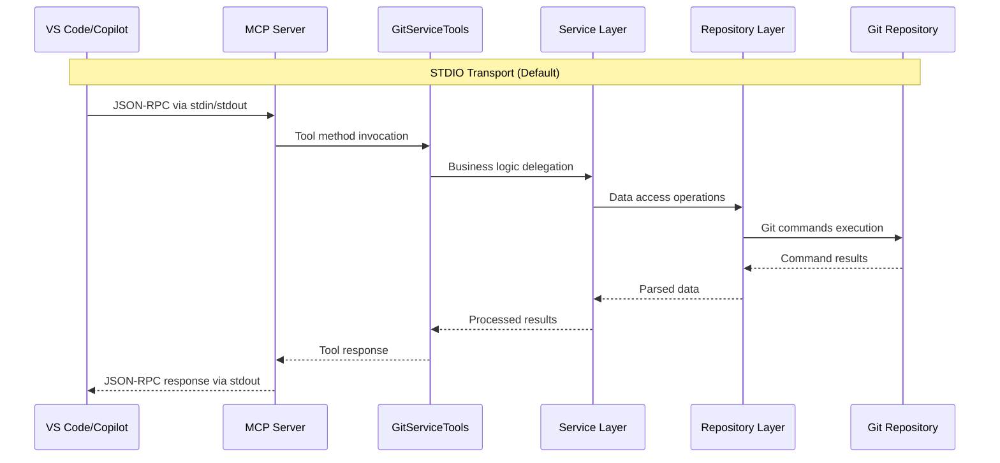
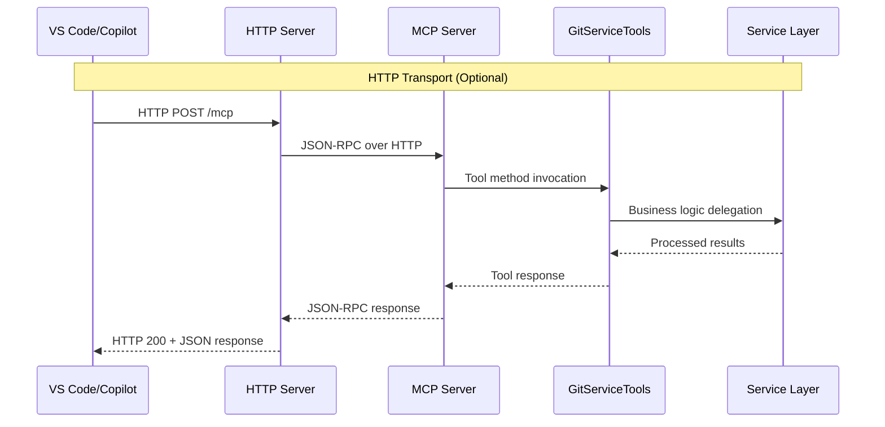

# GitVisionMCP Architecture Documentation

## Overview

GitVisionMCP is a Model Context Protocol (MCP) Server implementation that provides git repository analysis and documentation generation capabilities. The application serves as a bridge between VS Code Copilot agents and git repository operations, enabling automated documentation generation, branch comparison, commit analysis, and file content searching across various formats (JSON, XML, YAML, CSV, Excel).

**Project Details:**

- **Application Name:** GitVisionMCP
- **Version:** 1.0.8.2
- **Release Branch:** origin/master
- **Transport Support:** Both STDIO and HTTP via environment variable configuration

## Architectural Relationship



## Component Responsibilities

### GitServiceTools (MCP Tool Provider)

**Primary Role:** Acts as the MCP framework integration layer, exposing git and file operations as MCP tools.

**Key Responsibilities:**

- Implements 30+ MCP tools with `[McpServerToolAttribute]` decorations
- Validates input parameters and handles error responses
- Orchestrates calls between services for complex operations
- Provides consistent error handling and logging across all tools
- Manages file path validation and directory creation

**Notable Tools:**

- `gv_generate_git_commit_report` - Generate commit documentation
- `gv_compare_branches_documentation` - Branch comparison with remote support
- `gv_search_json_file`, `gv_search_xml_file` - File content searching
- `gv_list_workspace_files` - Workspace file enumeration
- `gv_deconstruct_to_file` - C# code analysis and deconstruction

### MCP Framework Integration

**Primary Role:** Handles JSON-RPC 2.0 communication and tool discovery.

**Key Responsibilities:**

- Manages STDIO and HTTP transport protocols
- Provides tool registration and discovery mechanisms
- Handles request/response serialization
- Implements MCP protocol compliance

### Service Layer Architecture

#### IGitService / GitService

**Primary Role:** Git repository operations and documentation generation.

**Key Responsibilities:**

- Git log retrieval and commit analysis
- Branch comparison and diff generation
- Conflict marker detection
- Remote repository operations (fetch, branch listing)
- Documentation formatting (Markdown, HTML, Text)

#### IFileService / FileService

**Primary Role:** File system operations and workspace management.

**Key Responsibilities:**

- Workspace file enumeration and filtering
- File content reading with binary detection
- Workspace root path resolution
- File metadata extraction

#### IWorkspaceService / WorkspaceService

**Primary Role:** Structured file content searching and transformation.

**Key Responsibilities:**

- JSON, XML, YAML, CSV, Excel file parsing
- JSONPath and XPath query execution
- XSLT transformations
- Data format conversions

#### IDeconstructionService / DeconstructionService

**Primary Role:** C# code analysis and structure extraction.

**Key Responsibilities:**

- C# syntax tree parsing
- Service/Repository/Controller analysis
- JSON structure generation from code analysis

#### IUtilityService / UtilityService

**Primary Role:** Utility operations and application metadata.

**Key Responsibilities:**

- Application version extraction from project files
- Common utility functions

### Repository Layer Architecture

#### IGitRepository / GitRepository

**Primary Role:** Direct git command execution and data parsing.

**Key Responsibilities:**

- Git command-line interface operations
- Raw git output parsing
- Authentication handling for remote operations
- Low-level git repository access

#### IFileRepository / FileRepository

**Primary Role:** Direct file system access and operations.

**Key Responsibilities:**

- File I/O operations
- Directory traversal
- File metadata collection
- Binary file detection

#### IUtilityRepository / UtilityRepository

**Primary Role:** System-level utility operations.

**Key Responsibilities:**

- System information gathering
- Configuration file access
- Environment variable handling

## Transport-Specific Behavior

### STDIO Transport Sequence



### HTTP Transport Sequence



## Tool Discovery and Registration

The MCP framework automatically discovers tools through reflection:

1. **Class-Level Registration:** `[McpServerToolType]` attribute on `GitServiceTools`
2. **Method-Level Registration:** `[McpServerToolAttribute(Name = "tool_name")]` on individual methods
3. **Parameter Documentation:** `[Description("parameter description")]` on method parameters
4. **Automatic Discovery:** MCP framework scans and registers all decorated methods at startup

**Registration in Program.cs:**

```csharp
builder.Services.AddMcpServer()
    .WithStdioServerTransport() // or .WithHttpTransport()
    .WithTools<GitServiceTools>()
    .WithPrompts<ReleaseDocumentPrompts>();
```

## Configuration Logic

### Environment-Based Transport Selection

```csharp
var transportType = Environment.GetEnvironmentVariable("GITVISION_MCP_TRANSPORT") ?? "unset";
switch (transportType.ToLowerInvariant())
{
    case "http": /* HTTP Transport Configuration */ break;
    case "stdio": /* STDIO Transport Configuration */ break;
    default: /* Default to STDIO */ break;
}
```

### Configuration Management

- **Configuration Loading:** `IConfigLoader` reads from `.gitvision/config.json`
- **Hot Reloading:** `ConfigurationReloader` with file system watcher
- **Debounced Updates:** 250ms debounce for configuration changes
- **Fallback Handling:** Last-good configuration semantics

### Dependency Injection Structure

All components are registered as singletons except `IGitServiceTools` (transient):

- **Repositories:** Singleton lifetime for data access consistency
- **Services:** Singleton lifetime for business logic caching
- **Configuration:** Singleton with hot-reload capability via `ReloadableGitVisionConfig`

## Repository Pattern Architecture

### Design Benefits

1. **Separation of Concerns:** Clear distinction between business logic (Services) and data access (Repositories)
2. **Testability:** Repository interfaces enable easy mocking for unit tests
3. **Flexibility:** Multiple implementations possible (e.g., different git providers)
4. **Consistency:** Uniform error handling and logging patterns

### Service → Repository Delegation Pattern

```csharp
// Service delegates to Repository for data access
public async Task<List<GitCommitInfo>> GetGitLogsAsync(string repositoryPath, int maxCommits)
{
    // Business logic validation
    if (maxCommits <= 0) maxCommits = _config.Settings?.MaxCommits ?? 100;

    // Delegate to repository for data access
    return await _gitRepository.GetGitLogsAsync(repositoryPath, maxCommits);
}
```

## Key Differences Summary

| Component           | Purpose             | Scope                                           | Dependencies                |
| ------------------- | ------------------- | ----------------------------------------------- | --------------------------- |
| **GitServiceTools** | MCP Integration     | Tool exposure, parameter validation             | All Services                |
| **Services**        | Business Logic      | Data processing, validation, formatting         | Repositories, Configuration |
| **Repositories**    | Data Access         | File I/O, Git operations, external system calls | None (leaf nodes)           |
| **MCP Framework**   | Protocol Handler    | JSON-RPC, transport management                  | GitServiceTools             |
| **Configuration**   | Settings Management | Hot-reload, validation, defaults                | File System                 |

## Redundancy Analysis

### Intentional Redundancy

- **Service/Repository Interface Duplication:** `IGitService` and `IGitRepository` have similar signatures by design
- **Error Handling Layers:** Both Services and GitServiceTools implement error handling for different concerns
- **Configuration Caching:** Multiple configuration objects for different access patterns

### Eliminated Redundancy

- **McpHandler Removal:** Based on current `Program.cs`, the MCP framework directly manages protocol handling
- **Consolidated File Operations:** Single `IFileService` handles all file-related operations
- **Unified Workspace Management:** `IWorkspaceService` centralizes workspace-level operations

## Best Practices Observed

### Error Handling

- **Layered Exception Handling:** Different layers handle different types of errors
- **Specific Exception Types:** Custom exceptions for business logic failures
- **Comprehensive Logging:** Structured logging with context at each layer

### Performance Optimization

- **File Size Limits:** 10MB limit for individual file reads, 1000 file limit for bulk operations
- **Binary File Detection:** Automatic detection to prevent large binary file processing
- **Timeout Protection:** 5-minute timeout for search operations
- **Cached File Data:** Support for pre-fetched file information to reduce I/O

### Configuration Management

- **Environment-Based Selection:** Clean separation between STDIO and HTTP modes
- **Hot Configuration Reload:** Live configuration updates without restart
- **Graceful Degradation:** Fallback to defaults when configuration is invalid

### Code Quality

- **Interface Segregation:** Single-responsibility interfaces
- **Dependency Inversion:** All layers depend on abstractions
- **Consistent Naming:** Clear, descriptive naming conventions across all components

## Conclusion

GitVisionMCP demonstrates a well-architected MCP server implementation that successfully balances flexibility, maintainability, and performance. The layered architecture with clear separation between MCP integration, business logic, and data access provides a robust foundation for git repository analysis and documentation generation.

The dual transport support (STDIO/HTTP) with environment-based selection makes the application suitable for various deployment scenarios, while the comprehensive tool suite provides extensive git and file analysis capabilities for VS Code Copilot integration.

**Key Architectural Strengths:**

- Clean separation of concerns with repository pattern
- Comprehensive error handling and logging
- Hot-reloadable configuration management
- Performance-optimized file operations
- Extensive MCP tool coverage for git operations

**Deployment Flexibility:**

- Container-ready with Dockerfile
- Environment-based transport configuration
- Cross-platform compatibility
- VS Code Copilot agent integration ready
