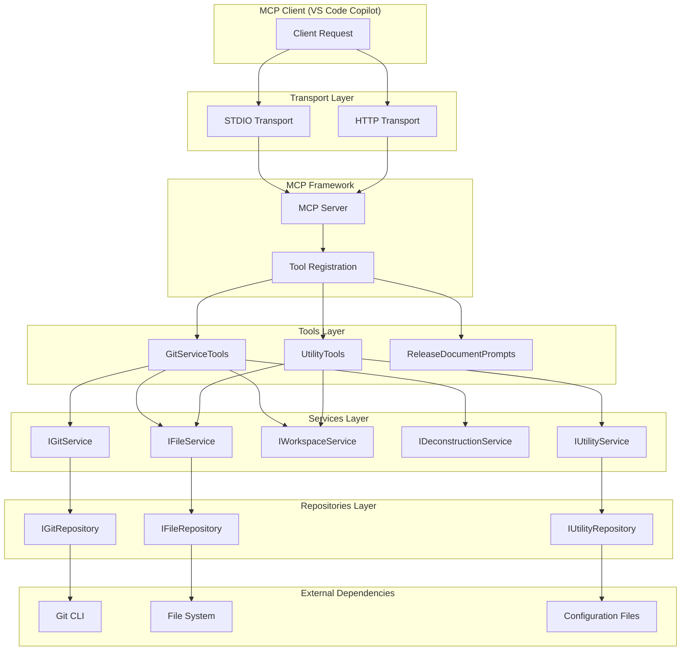
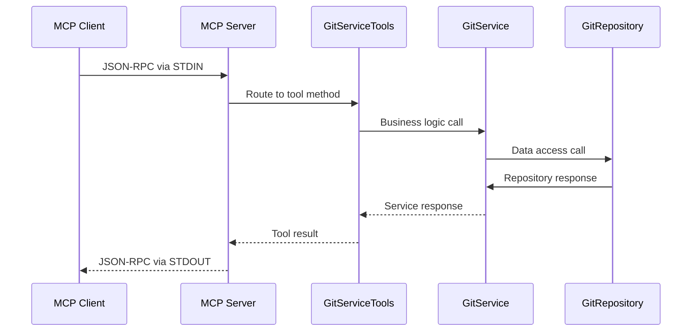
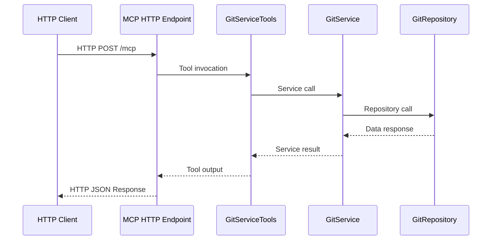

# GitVisionMCP 1.0.9.1 Architecture

## Release Branch: origin/GitVisionMCP-Release-1.0.9 | Current Branch: GitVisionMCP-Release-1.0.9.1

---

## Overview

GitVisionMCP is a Model Context Protocol (MCP) server implementation that provides Git-based documentation generation and repository analysis tools. The application is built using C# and the ASP.NET Core framework, designed to operate in both STDIO and HTTP transport modes. It serves as a bridge between Git repositories and MCP clients (such as VS Code Copilot) by exposing Git operations and file system analysis capabilities through standardized MCP tool interfaces.

The architecture follows a clean, layered design with distinct separation between:

- **MCP Framework Integration** - Protocol handling and transport management
- **Tool Interface Layer** - MCP-exposed tools with attribute-based discovery
- **Service Layer** - Business logic orchestration and domain operations
- **Repository Layer** - Data access and external system integration

## Architectural Relationship



## Component Responsibilities

### MCP Framework Integration

- **Transport Management**: Configurable STDIO/HTTP transport based on `GITVISION_MCP_TRANSPORT` environment variable
- **Tool Registration**: Automatic discovery and registration of tools decorated with `[McpServerToolAttribute]`
- **JSON-RPC 2.0**: Protocol compliance for client-server communication
- **Lifecycle Management**: Graceful startup, shutdown, and error handling

### GitServiceTools (Primary Tool Interface)

The main MCP tool class implementing `IGitServiceTools` with 31 exposed tools:

**Git Operations:**

- `gv_generate_git_commit_report`: Generate documentation from git logs
- `gv_compare_branches_documentation`: Compare differences between branches
- `gv_compare_commits_documentation`: Compare differences between commits
- `gv_get_recent_commits`: Retrieve recent commit information
- `gv_get_current_branch`: Get active branch name
- `gv_fetch_from_remote`: Fetch latest changes from remote

**File System Operations:**

- `gv_list_workspace_files`: List and filter workspace files
- `gv_read_filtered_workspace_files`: Read contents of filtered files
- `gv_search_json_file`: JSONPath queries on JSON files
- `gv_search_xml_file`: XPath queries on XML files
- `gv_search_yaml_file`: JSONPath queries on YAML files
- `gv_search_csv_file`: JSONPath queries on CSV files
- `gv_search_excel_file`: JSONPath queries on Excel files

**Analysis Operations:**

- `gv_deconstruct_to_file`: Analyze C# file structure
- `gv_git_find_merge_conflicts`: Detect Git merge conflicts
- `gv_get_app_version`: Extract application version information

### UtilityTools (Process & Environment Management)

The utility MCP tool class implementing `IUtilityTools` with 4 exposed tools:

**Process Management:**

- `gv_run_process`: Execute external processes with environment variable support
- `gv_run_plugin`: Execute configured plugins from .gitvision/config.json

**Environment Operations:**

- `gv_get_environment_variable`: Retrieve environment variable values
- `gv_set_environment_variable`: Set environment variables for the current process

### Services Layer

Provides business logic and orchestration:

- **IGitService**: Git operations, commit analysis, branch management, diff generation
- **IFileService**: File system operations, content reading, workspace analysis
- **IWorkspaceService**: Project structure analysis, configuration management
- **IDeconstructionService**: C# code analysis and structure extraction
- **IUtilityService**: Helper functions, version extraction, utility operations

### Repositories Layer

Handles direct data access and external system integration:

- **IGitRepository**: Direct Git CLI interactions, repository operations
- **IFileRepository**: File system access, directory traversal, content reading
- **IUtilityRepository**: Configuration access, utility data operations

## Transport-Specific Behavior

### STDIO Transport Flow



### HTTP Transport Flow



## Tool Discovery and Registration

The MCP framework automatically discovers tools through:

1. **Attribute-Based Registration**: Classes decorated with `[McpServerToolType]`
2. **Method Discovery**: Public methods decorated with `[McpServerToolAttribute]`
3. **Dependency Injection**: Automatic resolution of service dependencies
4. **Runtime Registration**: Dynamic tool availability based on configuration

Example tool registration in `Program.cs`:

```csharp
builder.Services.AddMcpServer().WithStdioServerTransport()
    .WithTools<GitServiceTools>()
    .WithTools<UtilityTools>()
    .WithPrompts<ReleaseDocumentPrompts>();
```

## Configuration Logic

### Environment-Based Transport Selection

The application determines transport mode via the `GITVISION_MCP_TRANSPORT` environment variable:

- **"Http"**: Configures HTTP transport with Kestrel server, enables controllers and JSON options
- **"Stdio"**: Configures STDIO transport for direct client communication
- **Default/Invalid**: Falls back to STDIO transport with warning logged

### Service Registration Pattern

All services follow a consistent registration pattern:

1. **Repository Layer**: Singleton registration for data access
2. **Service Layer**: Singleton registration for business logic
3. **Tool Layer**: Transient registration for MCP tool instances
4. **Configuration**: Singleton with file-watching capabilities for live reloading

### Configuration File Watching

The system implements automatic configuration reloading:

- Monitors `.gitvision/config.json` for changes
- Uses `FileSystemWatcher` with debouncing (250ms)
- Provides `ReloadableGitVisionConfig` wrapper for thread-safe updates
- Maintains last-known-good configuration on reload failures

## Repository Pattern Architecture

### Benefits Realized

1. **Separation of Concerns**: Clear distinction between business logic (Services) and data access (Repositories)
2. **Testability**: Repository interfaces enable easy mocking for unit tests
3. **Flexibility**: Can swap implementations (Git CLI vs LibGit2Sharp) without affecting services
4. **Caching**: Repository layer can implement caching strategies transparently
5. **Error Handling**: Centralized error handling and retry logic at repository boundaries

### Implementation Details

- **Interface-First Design**: All repositories implement contracts (`IGitRepository`, `IFileRepository`)
- **Dependency Injection**: Services depend on repository interfaces, not concrete implementations
- **Async/Await**: Full async support throughout the call chain
- **Resource Management**: Proper disposal of Git handles and file streams

## Key Differences Summary

| Component           | Purpose                                 | Technology Stack                          | Client Exposure        |
| ------------------- | --------------------------------------- | ----------------------------------------- | ---------------------- |
| **MCP Framework**   | Protocol handling, transport management | ModelContextProtocol.Server               | Indirect via JSON-RPC  |
| **GitServiceTools** | Tool interface, parameter validation    | MCP Attributes                            | Direct client exposure |
| **UtilityTools**    | Process and environment management      | MCP Attributes                            | Direct client exposure |
| **Services**        | Business logic, orchestration           | .NET Core, dependency injection           | Internal only          |
| **Repositories**    | Data access, external integration       | LibGit2Sharp, File I/O, Process execution | Internal only          |

## Redundancy Analysis

### Eliminated Redundancies

1. **Configuration Loading**: Single `IConfigLoader` service eliminates duplicate config reading
2. **Git Operations**: Centralized in `GitRepository` to avoid duplicate Git CLI calls
3. **File System Access**: Unified through `FileRepository` with consistent error handling
4. **Logging**: Single Serilog configuration across all components

### Maintained Redundancies (By Design)

1. **Service/Repository Interfaces**: Maintained for testability and flexibility
2. **Transport Options**: STDIO and HTTP both supported for different deployment scenarios
3. **Error Handling**: Multiple layers provide graceful degradation

## Best Practices Observed

### Code Organization

- **Clean Architecture**: Clear separation between tools, services, and repositories
- **Interface Segregation**: Focused, single-responsibility interfaces
- **Dependency Injection**: Consistent use of DI container for all dependencies

### Error Handling

- **Structured Logging**: Comprehensive logging with correlation IDs
- **Graceful Degradation**: Tools continue operating when individual operations fail
- **Client-Friendly Messages**: Error responses formatted for MCP protocol

### Performance

- **Async Operations**: Full async/await throughout the call chain
- **Resource Management**: Proper disposal of Git repositories and file handles
- **Caching Strategy**: Configuration caching with file-watching invalidation

### Security

- **Input Validation**: Parameter validation at tool interface level
- **Path Traversal Protection**: Safe file path handling in file operations
- **Process Isolation**: External process execution with timeout and resource limits

## Conclusion

The GitVisionMCP architecture successfully implements a scalable, maintainable MCP server with the following key strengths:

1. **Protocol Compliance**: Full MCP specification adherence with JSON-RPC 2.0 support
2. **Transport Flexibility**: Support for both STDIO and HTTP transports
3. **Extensibility**: Easy addition of new tools through attribute-based registration
4. **Reliability**: Robust error handling and configuration management
5. **Performance**: Efficient async operations with proper resource management

The layered architecture ensures that the system can evolve independently at each level, while the repository pattern provides flexibility for future enhancements such as caching, performance optimization, or alternative data access strategies.

The system currently provides **35 MCP tools** across two main categories (Git operations and utility functions), making it a comprehensive solution for repository analysis and documentation generation workflows.
