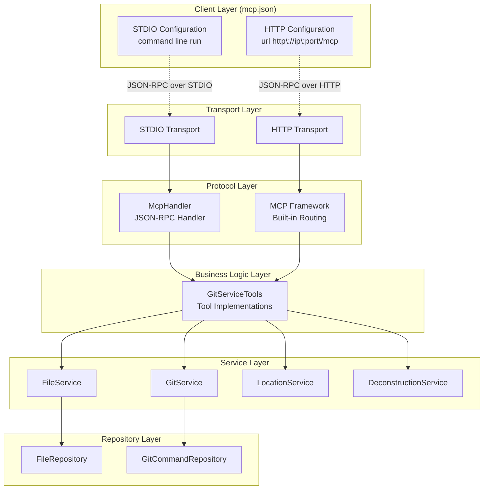
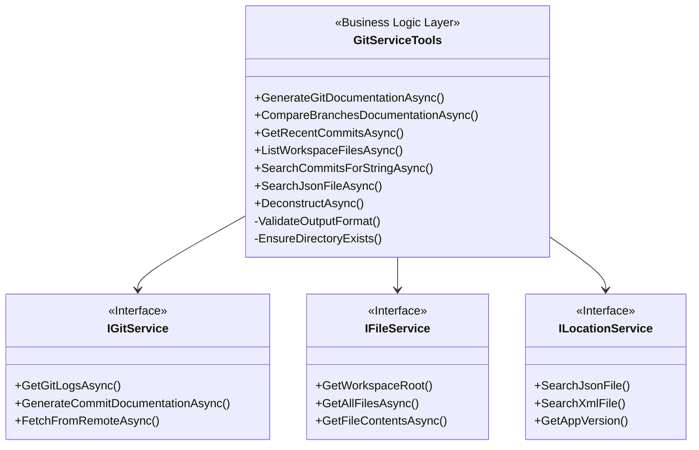
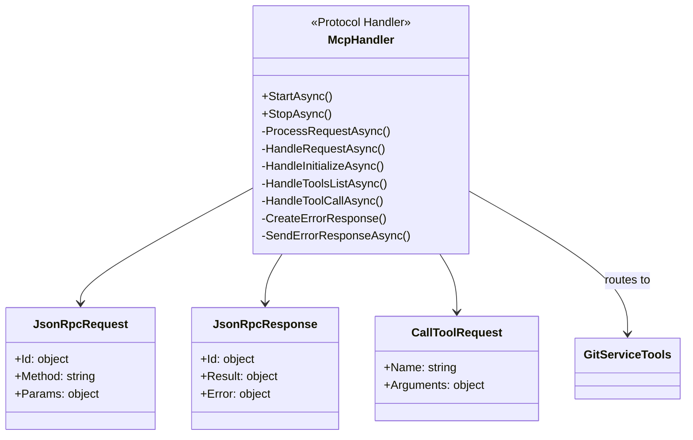
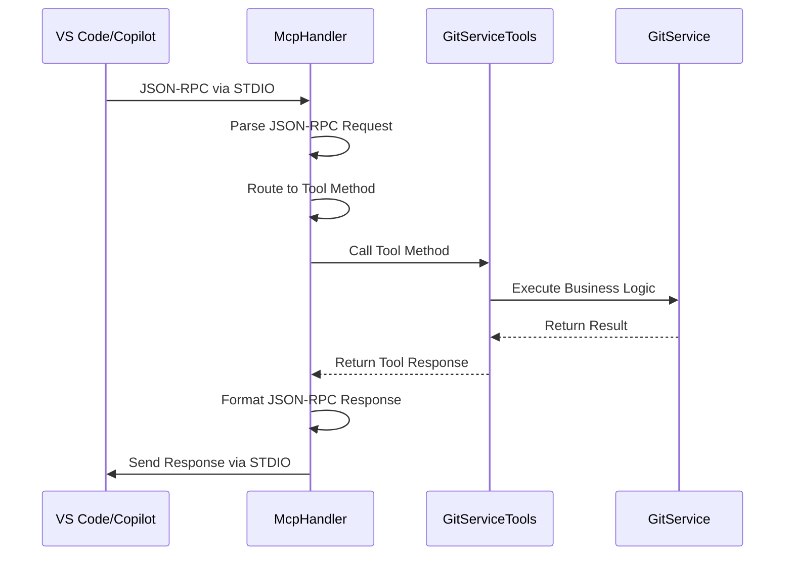
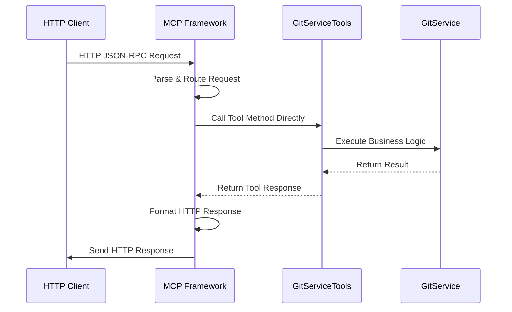
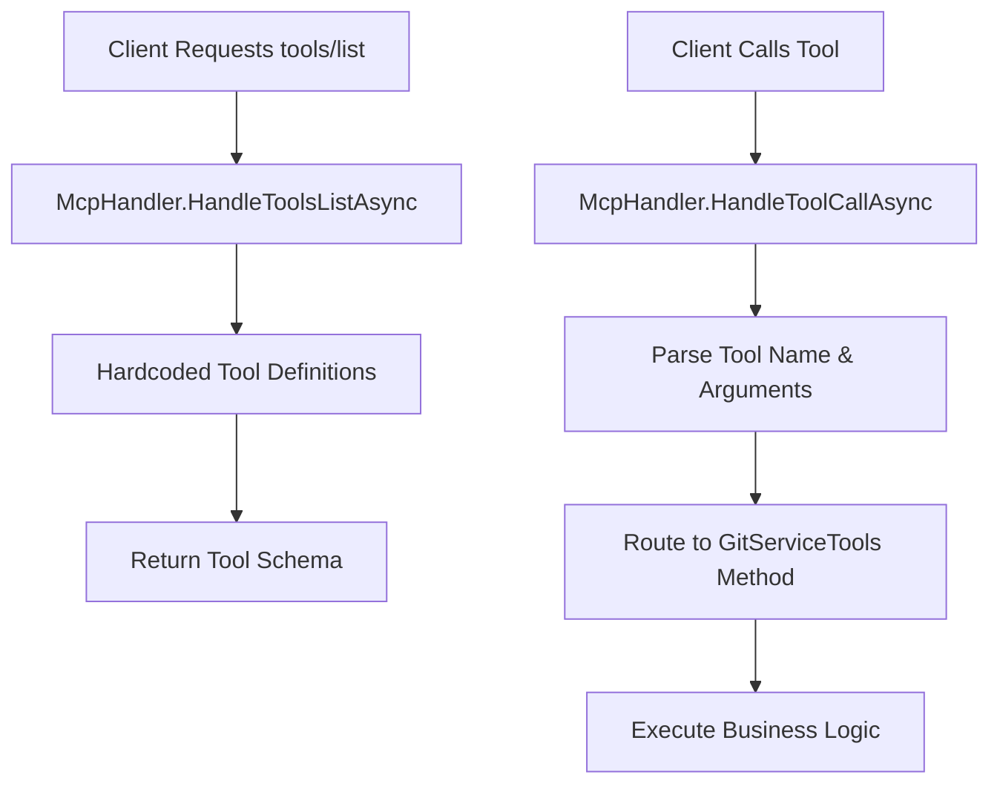
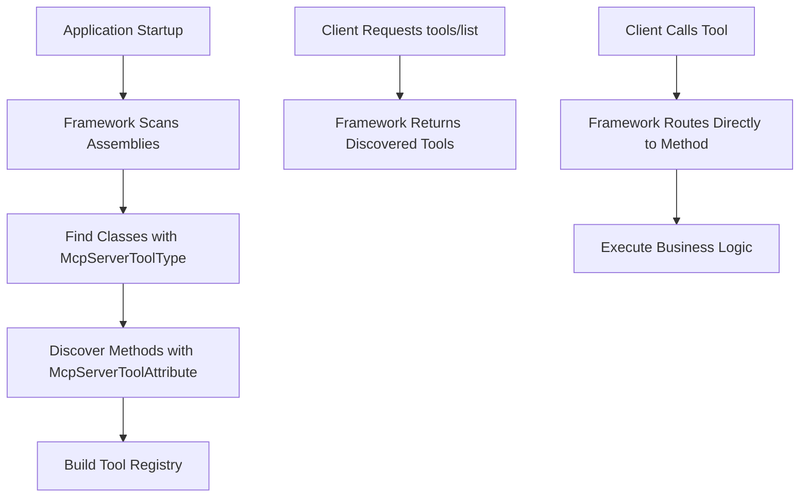

# GitServiceTools vs McpHandler - Architecture Documentation

## Overview

This document explains the functional differences between `GitServiceTools` and `McpHandler` in the GitVisionMCP project. These components serve distinct but complementary roles in the Model Context Protocol (MCP) server architecture.

## Architectural Relationship



## Component Responsibilities

### GitServiceTools

**Purpose**: Business logic layer containing MCP tool implementations

**Key Characteristics**:

- **Transport Agnostic**: Works with both STDIO and HTTP transports
- **Business Logic**: Contains actual implementation of git operations, file operations, etc.
- **MCP Annotations**: Decorated with `[McpServerToolAttribute]` for automatic discovery
- **Service Dependencies**: Consumes other services (GitService, FileService, etc.)



### McpHandler

**Purpose**: STDIO-specific protocol handler for JSON-RPC communication

**Key Characteristics**:

- **Transport Specific**: Only used for STDIO transport
- **Protocol Handler**: Manages JSON-RPC message parsing and routing
- **No Business Logic**: Routes requests to GitServiceTools
- **Communication**: Handles STDIO input/output streams



## Transport-Specific Behavior

### STDIO Transport Flow



### HTTP Transport Flow



## Tool Discovery Mechanisms

### STDIO Discovery (via McpHandler)



### HTTP Discovery (via MCP Framework)



## Configuration Logic in Program.cs

```mermaid
flowchart TD
    A[Application Starts] --> B{Check GITVISION_MCP_TRANSPORT}

    B -->|"http"| C[Configure HTTP Transport]
    B -->|"stdio"| D[Configure STDIO Transport]
    B -->|"unset" or invalid| E[Default to STDIO]

    C --> F[builder.Services.AddMcpServer().WithHttpTransport()]
    C --> G[Add HTTP Middleware & Controllers]
    C --> H[app.MapMcp("/mcp")]
    C --> I[app.Run()]

    D --> J[builder.Services.AddMcpServer().WithStdioServerTransport()]
    E --> J
    J --> K[Register IMcpHandler as McpHandler]
    J --> L[Get IMcpServer Service]
    L --> M[await mcpServer.RunAsync()]

    style C fill:#e8f5e8
    style D fill:#fff2cc
    style F fill:#e8f5e8
    style J fill:#fff2cc
```

## Key Differences Summary

| Aspect                | GitServiceTools                                | McpHandler                               |
| --------------------- | ---------------------------------------------- | ---------------------------------------- |
| **Purpose**           | Business logic implementation                  | Protocol communication handler           |
| **Transport Support** | Both HTTP and STDIO                            | STDIO only                               |
| **Responsibilities**  | Tool functionality, validation, error handling | JSON-RPC parsing, routing, serialization |
| **Dependencies**      | Service layer (GitService, FileService, etc.)  | GitServiceTools for actual work          |
| **Discovery**         | MCP attributes for auto-discovery              | Manual tool registration                 |
| **Lifecycle**         | Transient per request                          | Singleton for application lifetime       |
| **Error Handling**    | Business logic errors                          | Protocol and communication errors        |

## Redundancy Analysis

**No Functional Redundancy Exists**:

1. **GitServiceTools** contains the actual business logic and tool implementations
2. **McpHandler** provides STDIO-specific communication protocol handling
3. **HTTP transport** bypasses McpHandler entirely and uses the MCP framework's built-in routing
4. **Both are necessary** for supporting multiple transport protocols

## Best Practices Observed

### GitServiceTools Implementation

- ✅ Comprehensive input validation with detailed error messages
- ✅ Structured logging with contextual information
- ✅ Proper exception handling with specific exception types
- ✅ XML documentation for all public methods
- ✅ Defensive programming with null checks and boundary validation

### McpHandler Implementation

- ✅ Protocol-specific error handling for JSON-RPC
- ✅ Proper resource management and cleanup
- ✅ Cancellation token support for graceful shutdown
- ✅ Separation of concerns between protocol and business logic

## Conclusion

GitServiceTools and McpHandler serve complementary but distinct roles in the MCP server architecture. GitServiceTools provides transport-agnostic business logic, while McpHandler provides STDIO-specific protocol handling. This separation enables the application to support multiple transport protocols efficiently without
