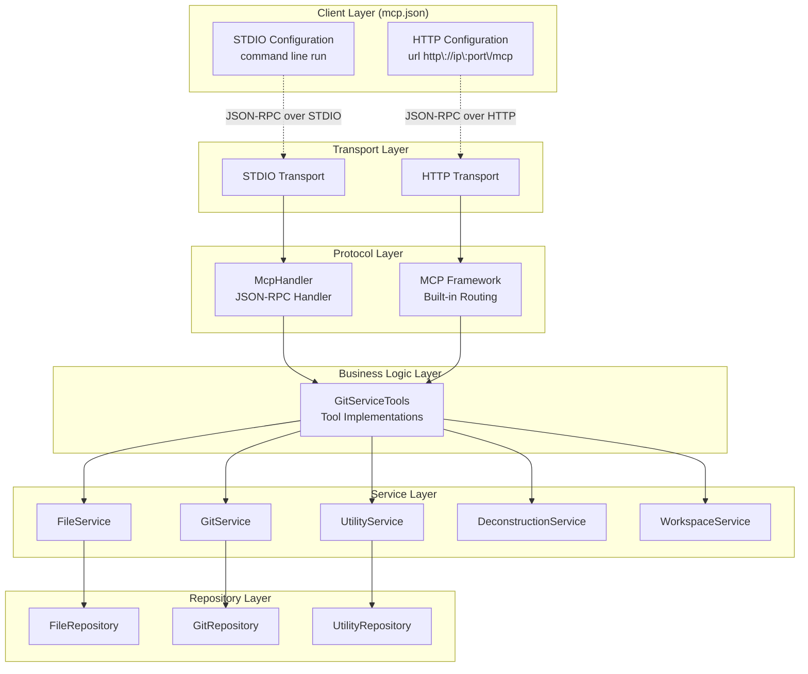
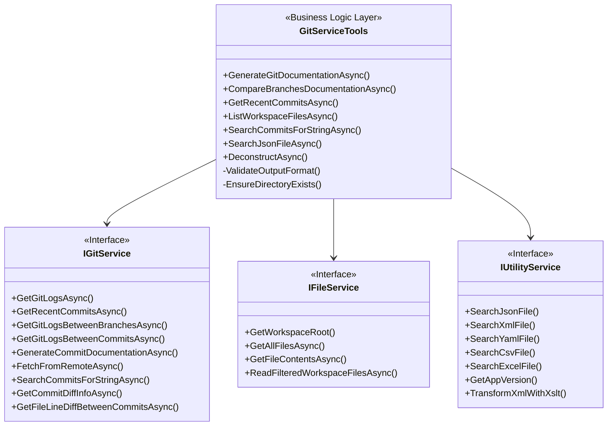
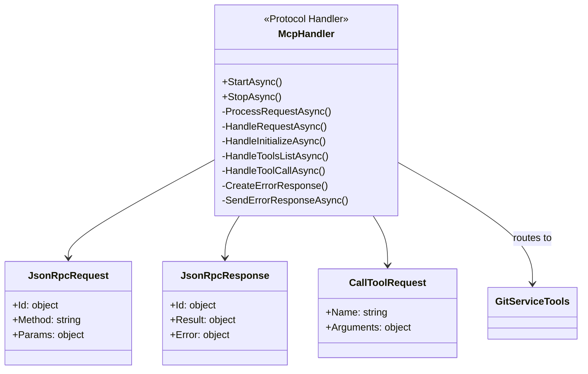
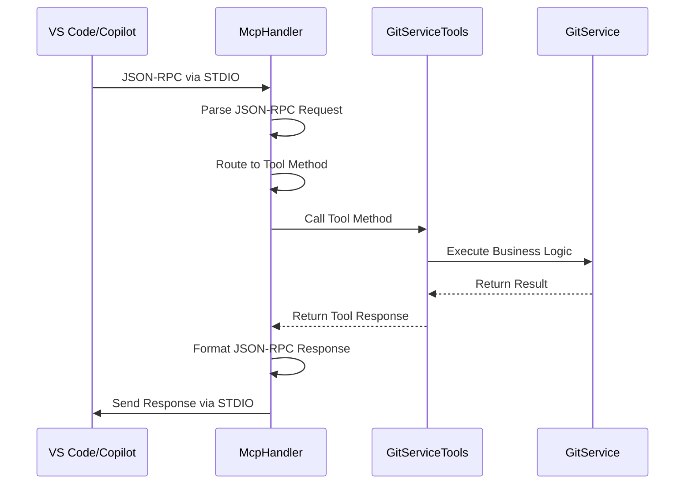
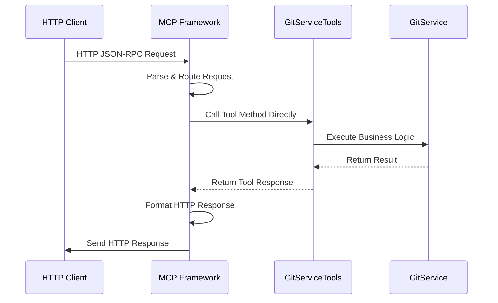
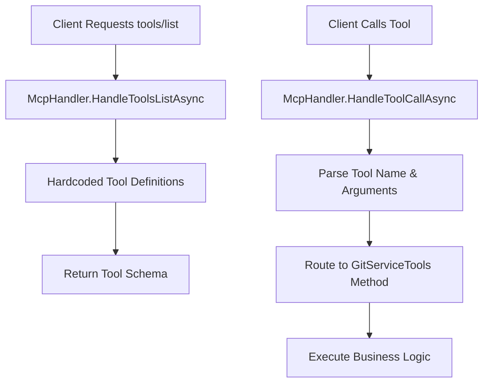
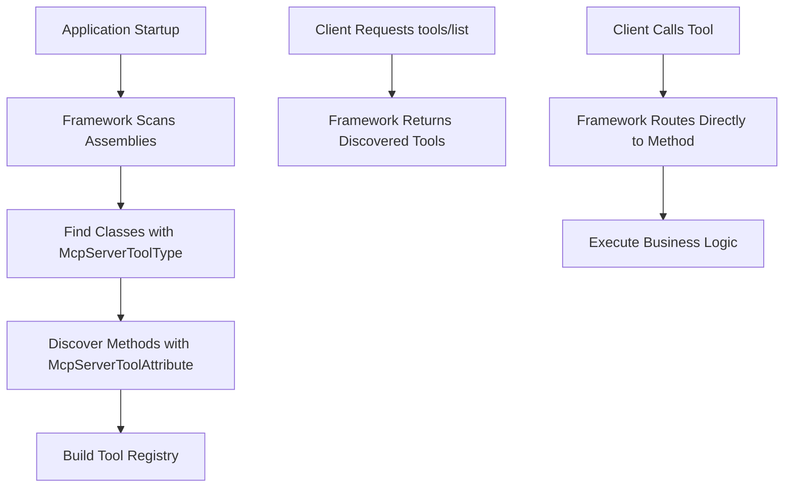
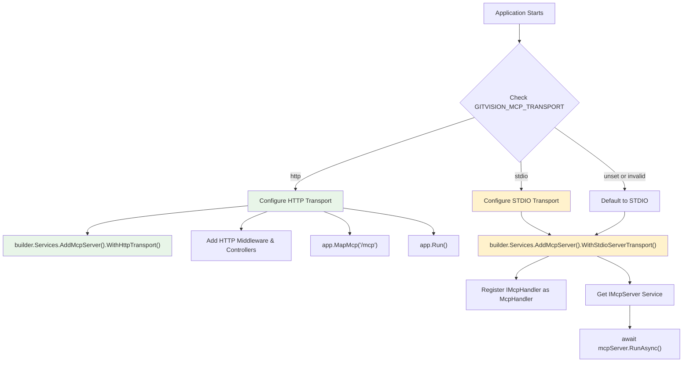
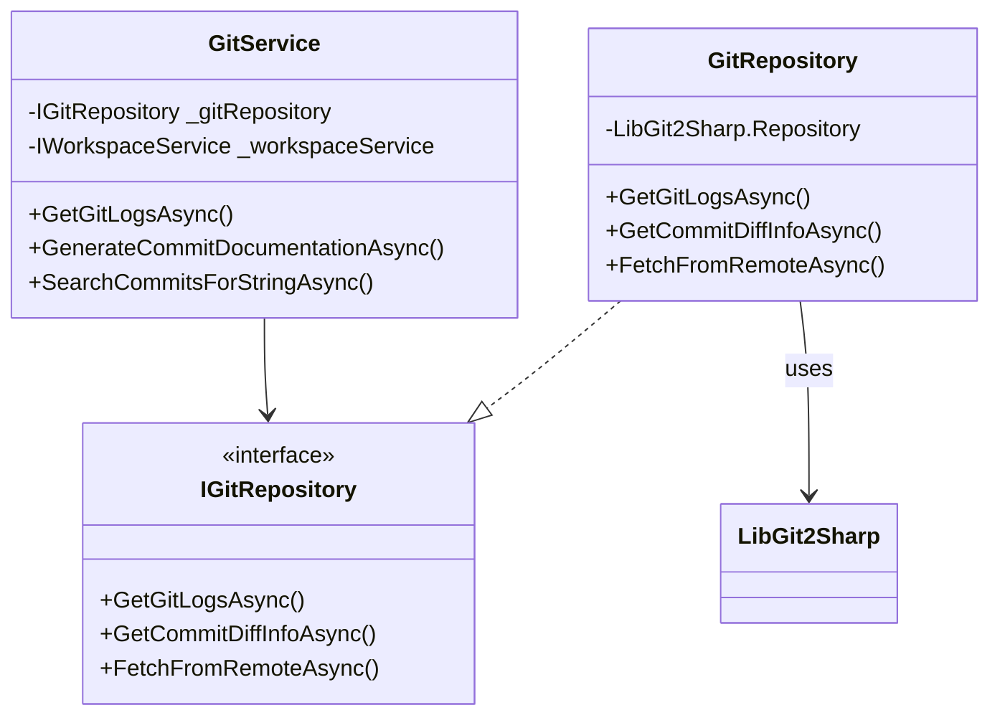

# GitServiceTools vs McpHandler - Architecture Documentation

## Overview

This document explains the functional differences between `GitServiceTools` and `McpHandler` in the GitVisionMCP project. These components serve distinct but complementary roles in the Model Context Protocol (MCP) server architecture.

## Architectural Relationship

## Component Responsibilities

### GitServiceTools

**Purpose**: Business logic layer containing MCP tool implementations

**Key Characteristics**:

- **Transport Agnostic**: Works with both STDIO and HTTP transports
- **Business Logic**: Contains actual implementation of git operations, file operations, etc.
- **MCP Annotations**: Decorated with `[McpServerToolAttribute]` for automatic discovery
- **Service Dependencies**: Consumes other services (GitService, FileService, etc.)

### McpHandler

**Purpose**: STDIO-specific protocol handler for JSON-RPC communication

**Key Characteristics**:

- **Transport Specific**: Only used for STDIO transport
- **Protocol Handler**: Manages JSON-RPC message parsing and routing
- **No Business Logic**: Routes requests to GitServiceTools
- **Communication**: Handles STDIO input/output streams

## Transport-Specific Behavior

### STDIO Transport Flow

### HTTP Transport Flow

## Tool Discovery Mechanisms

### STDIO Discovery (via McpHandler)

### HTTP Discovery (via MCP Framework)

## Configuration Logic in Program.cs

## Repository Pattern Architecture

The project implements a clean repository pattern with clear separation of concerns:

### Service Layer

- **GitService**: Orchestrates git operations through delegation to GitRepository
- **FileService**: Manages file system operations through FileRepository
- **UtilityService**: Handles specialized operations (JSON/XML/YAML parsing) through UtilityRepository
- **DeconstructionService**: Provides C# code analysis capabilities
- **WorkspaceService**: Manages workspace-related operations

### Repository Layer

- **GitRepository**: Direct interaction with LibGit2Sharp for git operations
- **FileRepository**: Direct file system I/O operations
- **UtilityRepository**: Direct interaction with parsing libraries (Newtonsoft.Json, System.Xml, etc.)

### Benefits of This Architecture

- **Separation of Concerns**: Business logic separated from data access
- **Testability**: Services can be unit tested with mocked repositories
- **Maintainability**: Changes to git operations only affect the repository layer
- **Dependency Inversion**: Services depend on interfaces, not concrete implementations

## Key Differences Summary

| Aspect                | GitServiceTools                                                                                                               | McpHandler                               |
| --------------------- | ----------------------------------------------------------------------------------------------------------------------------- | ---------------------------------------- |
| **Purpose**           | Business logic implementation                                                                                                 | Protocol communication handler           |
| **Transport Support** | Both HTTP and STDIO                                                                                                           | STDIO only                               |
| **Responsibilities**  | Tool functionality, validation, error handling                                                                                | JSON-RPC parsing, routing, serialization |
| **Dependencies**      | Service layer interfaces (IGitService, IFileService, IUtilityService, etc.) and repository layer through dependency injection | GitServiceTools for actual work          |
| **Discovery**         | MCP attributes for auto-discovery                                                                                             | Manual tool registration                 |
| **Lifecycle**         | Transient per request                                                                                                         | Singleton for application lifetime       |
| **Error Handling**    | Business logic errors                                                                                                         | Protocol and communication errors        |

## Redundancy Analysis

**No Functional Redundancy Exists**:

1. **GitServiceTools** contains the actual business logic and tool implementations
2. **McpHandler** provides STDIO-specific communication protocol handling
3. **HTTP transport** bypasses McpHandler entirely and uses the MCP framework's built-in routing
4. **Service Layer** provides business logic orchestration and validation
5. **Repository Layer** provides direct data access and external library interaction
6. **All components are necessary** for supporting multiple transport protocols and maintaining clean architecture

## Architectural Benefits

### Repository Pattern Implementation

- ✅ **Clean Separation**: Business logic (services) separated from data access (repositories)
- ✅ **Testability**: Services can be unit tested with mocked repositories
- ✅ **Dependency Inversion**: Services depend on interfaces, enabling flexibility
- ✅ **Single Responsibility**: Each repository handles one type of data access

### Service Layer Benefits

- ✅ **Orchestration**: Services coordinate between multiple repositories
- ✅ **Business Logic**: Complex operations span multiple data sources
- ✅ **Validation**: Input validation and business rule enforcement
- ✅ **Error Handling**: Centralized exception handling and logging

## Best Practices Observed

### GitServiceTools Implementation

- ✅ Comprehensive input validation with detailed error messages
- ✅ Structured logging with contextual information
- ✅ Proper exception handling with specific exception types
- ✅ XML documentation for all public methods
- ✅ Defensive programming with null checks and boundary validation

### McpHandler Implementation

- ✅ Protocol-specific error handling for JSON-RPC
- ✅ Proper resource management and cleanup
- ✅ Cancellation token support for graceful shutdown
- ✅ Separation of concerns between protocol and business logic

## Conclusion

The GitVisionMCP project implements a robust, multi-layered architecture that successfully separates concerns across four distinct layers:

1. **Tool Layer (GitServiceTools)**: Transport-agnostic business logic for MCP tool implementations
2. **Protocol Layer (McpHandler)**: STDIO-specific JSON-RPC communication handling
3. **Service Layer**: Business logic orchestration and coordination between repositories
4. **Repository Layer**: Direct data access and external library interaction

This architecture enables:

- **Multiple Transport Support**: Both HTTP and STDIO protocols
- **Clean Testing**: Unit tests with proper mocking at each layer
- **Maintainable Code**: Clear separation of concerns and dependency inversion
- **Extensible Design**: Easy addition of new repositories and services

The repository pattern refactoring has eliminated code duplication, improved testability, and created a more maintainable codebase that follows SOLID principles and clean architecture guidelines.
