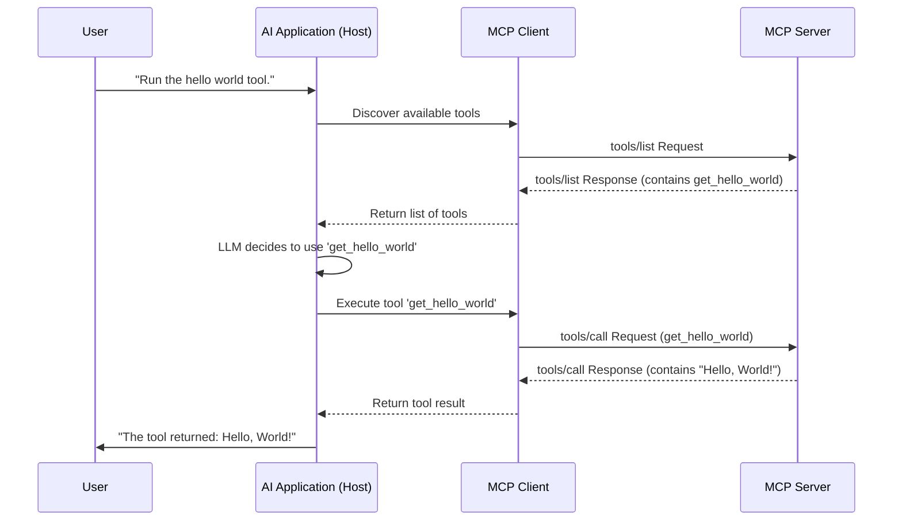

# Creating a C# Model Context Protocol (MCP) Server: A Guide

This document provides a comprehensive guide to creating a Model Context Protocol (MCP) server using C#. It is structured into two parts:

- **Part 1: The Beginner's Quick Start**: A step-by-step tutorial to get a basic MCP server running in minutes.
- **Part 2: Advanced Guide & Core Concepts**: A detailed exploration of advanced features, architecture, and customization options.

---

## Part 1: The Beginner's Quick Start

This section will walk you through the essential steps to create, run, and connect to a simple C# MCP server.

### 1.1. What is MCP? (A Quick Summary)

The Model Context Protocol (MCP) is a standard that allows AI applications (like Copilot) to connect with external tools and data sources. Think of it as a "USB-C port" for AI, enabling it to interact with your local file system, databases, or custom APIs in a secure, structured way. An MCP server exposes these capabilities to the AI.

### 1.2. Step 1: Project Setup

First, create a new **.NET Web Application** project and add the following NuGet packages to your `.csproj` file.

```xml
<ItemGroup>
  <PackageReference Include="ModelContextProtocol" Version="0.1.0-alpha" />
  <PackageReference Include="Serilog" Version="3.1.1" />
  <PackageReference Include="Serilog.Sinks.File" Version="5.0.0" />
</ItemGroup>
```

### 1.3. Step 2: Create the Server (`Program.cs`)

Replace the content of your `Program.cs` with the following code. This sets up a minimal MCP server that communicates over Standard I/O (Stdio).

```csharp
using ModelContextProtocol.Server;
using Serilog;
using System.ComponentModel;

// 1. Configure basic logging
Log.Logger = new LoggerConfiguration()
    .MinimumLevel.Debug()
    .WriteTo.File("logs/mcp-server.log", rollingInterval: RollingInterval.Day)
    .CreateLogger();

var builder = WebApplication.CreateBuilder(args);
builder.Logging.ClearProviders().AddSerilog(Log.Logger);

// 2. Add MCP Server services and register your tool class
builder.Services.AddMcpServer().WithStdioServerTransport()
    .WithTools<MySimpleTools>();

var app = builder.Build();

// 3. Run the MCP server
var mcpServer = app.Services.GetRequiredService<IMcpServer>();
await mcpServer.RunAsync();

// 4. Define your tool class
[McpServerToolType]
public class MySimpleTools
{
    [McpServerTool("get_hello_world")]
    [Description("Returns the classic 'Hello, World!' string.")]
    public string GetHelloWorld()
    {
        return "Hello, World!";
    }
}
```

### 1.4. Step 3: Configure the Client (`mcp.json`)

An AI application needs to know how to start your server. Create a file named `mcp.json` in your project's root directory with the following content. **Remember to replace the placeholder path with the actual path to your project's `.csproj` file.**

```json
{
  "servers": {
    "MySimpleServer": {
      "type": "stdio",
      "command": "dotnet",
      "args": [
        "run",
        "--project",
        "C:\\path\\to\\your\\project\\YourProjectName.csproj"
      ]
    }
  }
}
```

### 1.5. Running Your First MCP Server

With these files in place, your MCP server is ready. An MCP-compatible client (like the VS Code Copilot Agent) can now use the `mcp.json` file to launch your server and call the `get_hello_world` tool.

You have successfully built a basic MCP server! To learn more about what's happening under the hood, proceed to the Advanced Guide.

---

## Part 2: Advanced Guide & Core Concepts

This section dives deeper into the architecture, protocols, and advanced customization options for an MCP server.

### 2.1. MCP Architecture In-Depth

#### 2.1.1. Communication: Stdio vs. HTTP

MCP supports two primary transport mechanisms:

- **Stdio (Standard I/O)**: The server is launched as a subprocess by the client. Communication happens over `stdin` and `stdout`. This is highly efficient for local servers and is the simplest to configure.
- **HTTP**: The server runs as a web service, listening for POST requests on a specific endpoint (e.g., `/mcp`). This is ideal for remote servers or when network accessibility is required.

You can configure your server to support either transport based on an environment variable.

```csharp
// In Program.cs
var transportType = Environment.GetEnvironmentVariable("MCP_TRANSPORT") ?? "Stdio";

if (transportType.Equals("Http", StringComparison.OrdinalIgnoreCase))
{
    builder.Services.AddMcpServer().WithHttpTransport().WithTools<MyToolService>();
    // ... then run as a web app
    app.MapMcp("/mcp");
    app.Run();
}
else
{
    builder.Services.AddMcpServer().WithStdioServerTransport().WithTools<MyToolService>();
    // ... then run the server directly
    await app.Services.GetRequiredService<IMcpServer>().RunAsync();
}
```

#### 2.1.2. The JSON-RPC 2.0 Protocol

All MCP communication uses the **JSON-RPC 2.0** format. This involves three key interactions:

1.  **`initialize`**: The client connects and sends an `initialize` request to negotiate capabilities. The server responds with its name and supported features.
2.  **`tools/list`**: The client requests a list of all available tools. The server returns a JSON schema describing each tool, its purpose (`description`), and its parameters.
3.  **`tools/call`**: The client requests to execute a specific tool with a set of arguments. The server runs the corresponding method and returns the result.

**Example `tools/call` flow:**

_Client Request:_

```json
{
  "jsonrpc": "2.0",
  "id": 123,
  "method": "tools/call",
  "params": { "name": "get_hello_world", "arguments": {} }
}
```

_Server Response:_

```json
{
  "jsonrpc": "2.0",
  "id": 123,
  "result": { "content": [{ "type": "text", "text": "Hello, World!" }] }
}
```

#### 2.1.3. Dataflow Diagram

This Mermaid diagram illustrates the typical interaction sequence:



### 2.2. Advanced Server Customization

#### 2.2.1. Defining Complex Tools

For more complex tools, you can use dependency injection and provide detailed descriptions for parameters.

```csharp
[McpServerToolType]
public class GitServiceTools
{
    private readonly IGitService _gitService; // Injected via DI

    public GitServiceTools(IGitService gitService)
    {
        _gitService = gitService;
    }

    [McpServerTool("gv_compare_branches")]
    [Description("Generate documentation comparing differences between two branches.")]
    public async Task<string> CompareBranchesAsync(
        [Description("The primary branch to compare from")] string branch1,
        [Description("The secondary branch to compare to")] string branch2)
    {
        // ... implementation using _gitService ...
        return "Documentation generated successfully.";
    }
}
```

#### 2.2.2. Customizing the `initialize` Response and Tool List

For full control, you can implement your own `IMcpService` instead of relying solely on attributes. This allows you to programmatically define the server's capabilities and the tools it exposes.

**1. Create a Custom `McpService`:**
Inherit from `McpService` and override methods like `InitializeAsync` or `OnListToolsAsync`.

```csharp
public class CustomMcpService : McpService
{
    public override Task<InitializeResult> InitializeAsync(InitializeParams args, CancellationToken ct)
    {
        // Return custom server info and capabilities
        return Task.FromResult(new InitializeResult { /* ... */ });
    }

    public override Task<ListToolsResult> OnListToolsAsync(ListToolsParams args, CancellationToken ct)
    {
        // Return a programmatically generated list of tools
        var tools = new List<Tool> { /* ... */ };
        return Task.FromResult(new ListToolsResult { Tools = tools });
    }
}
```

**2. Register the Custom Service:**
In `Program.cs`, register your custom implementation.
`builder.Services.AddSingleton<IMcpService, CustomMcpService>();`

#### 2.2.3. Dynamically Modifying Tools at Runtime

You can notify the client that the tool list has changed (e.g., due to a configuration change).

**1. Declare the `listChanged` Capability:**
In your `initialize` response, ensure your server sends `capabilities: { tools: { listChanged: true } }`. The default `McpService` does this for you.

**2. Inject `IMcpConnection` and Send Notification:**
Inject the `IMcpConnection` into your service and call `NotifyAsync` when your tool list changes.

```csharp
public class MyDynamicToolManager
{
    private readonly IMcpConnection _mcpConnection;

    public MyDynamicToolManager(IMcpConnection mcpConnection)
    {
        _mcpConnection = mcpConnection;
    }

    public async Task RefreshTools()
    {
        // ... logic to update available tools ...

        // Notify the client to re-fetch the tool list
        await _mcpConnection.NotifyAsync("notifications/tools/list_changed", CancellationToken.None);
    }
}
```

Upon receiving this notification, the client will automatically call `tools/list` again to get the updated toolset.
