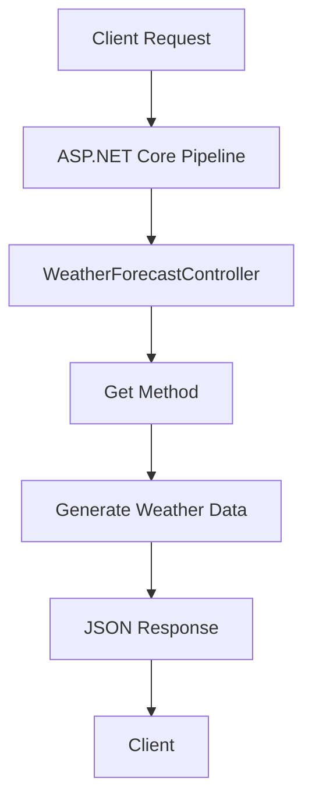

# ASP.NET Core API Documentation

Generated: July 20, 2025

## API Overview

This documentation provides comprehensive information about the GitVisionMCP API endpoints, authentication, and integration guides.

### Base URLs

- Development: `http://localhost:5000`
- Production: (Contact system administrator for production URLs)

### API Versioning

This API currently does not implement explicit versioning. All endpoints are considered v1.

## Controllers Overview

Total Controllers Found: 1

| Controller      | Base Route         | Description                              |
| --------------- | ------------------ | ---------------------------------------- |
| WeatherForecast | `/WeatherForecast` | Provides weather forecast data endpoints |

## Authentication

No authentication requirements are currently implemented in the API. All endpoints are publicly accessible.

## Controller Documentation

### WeatherForecastController

**Namespace**: `APITest.Controllers`  
**Base Route**: `/WeatherForecast`  
**Attributes**:

- `[ApiController]`
- `[Route("[controller]")]`

#### Endpoints

##### Get Weather Forecast

```http
GET /WeatherForecast
```

**Description**: Retrieves a collection of weather forecasts.

**Response Type**: `IEnumerable<WeatherForecast>`

**Example Request**:

```bash
curl -X GET "http://localhost:5000/WeatherForecast" \
     -H "Accept: application/json"
```

**Response Schema**:

```json
{
  "date": "2025-07-20T12:00:00Z", // ISO 8601 date format
  "temperatureC": 25,
  "temperatureF": 77,
  "summary": "Warm"
}
```

**Response Array Example**:

```json
[
  {
    "date": "2025-07-20T12:00:00Z",
    "temperatureC": 25,
    "temperatureF": 77,
    "summary": "Warm"
  },
  {
    "date": "2025-07-21T12:00:00Z",
    "temperatureC": 20,
    "temperatureF": 68,
    "summary": "Mild"
  }
]
```

### Data Flow Diagrams

#### Weather Forecast Request Flow



### Controller Architecture

See [Controller Architecture Diagram](./ControllerArchitecture.mmd) for a visual representation of the controller structure.

### Dependencies

The WeatherForecast controller has minimal dependencies:

- ASP.NET Core MVC infrastructure
- No explicit service injections observed
- No database or external service dependencies

### Error Handling

Standard ASP.NET Core error responses:

- 500 Internal Server Error: For unhandled exceptions
- 404 Not Found: For invalid routes

## Integration Examples

### PowerShell

```powershell
$response = Invoke-RestMethod -Uri "http://localhost:5000/WeatherForecast" -Method Get
$response | Format-Table
```

### C# HttpClient

```csharp
using var client = new HttpClient();
var forecasts = await client.GetFromJsonAsync<IEnumerable<WeatherForecast>>("http://localhost:5000/WeatherForecast");
```

### JavaScript/Fetch

```javascript
const response = await fetch("http://localhost:5000/WeatherForecast");
const forecasts = await response.json();
```

## Testing Tools

- **Swagger UI**: Available at `/swagger` when running in Development mode
- **Postman Collection**: Available upon request from the development team
- **VS Code REST Client**: Sample requests available in `WeatherForecast.http`

## Troubleshooting

Common Issues:

1. **Connection Refused**: Ensure the API is running and the port is correct
2. **404 Not Found**: Verify the endpoint URL is correct, including case sensitivity
3. **Serialization Errors**: Check response model matches expected schema
