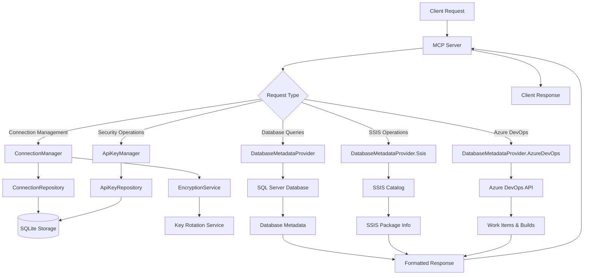
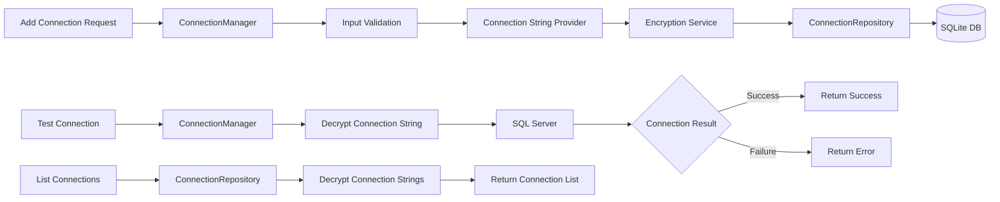
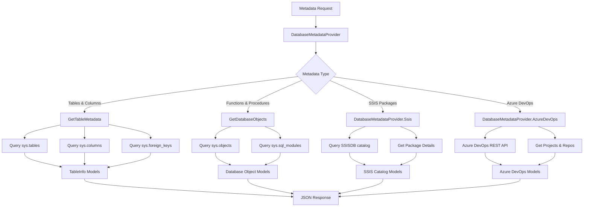
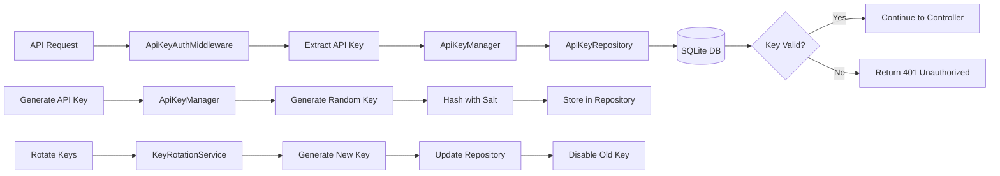
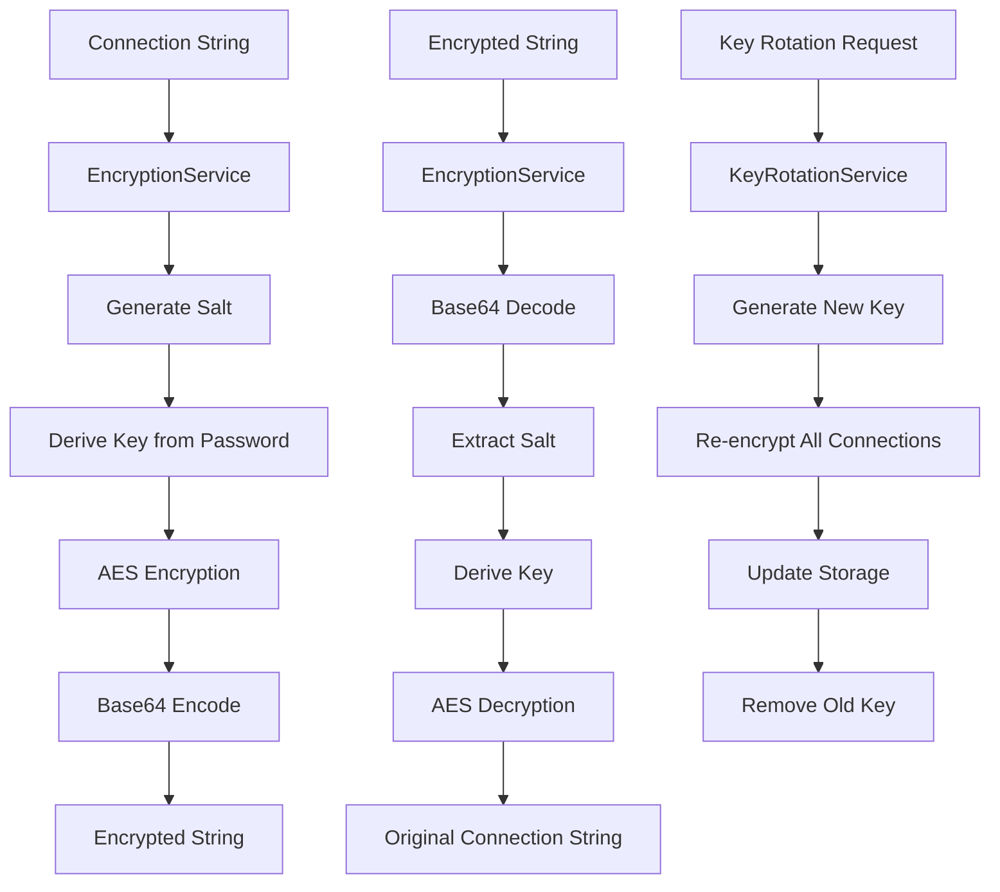
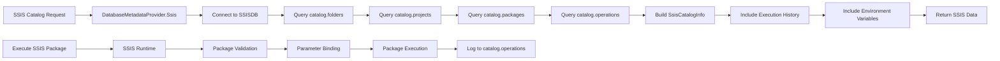
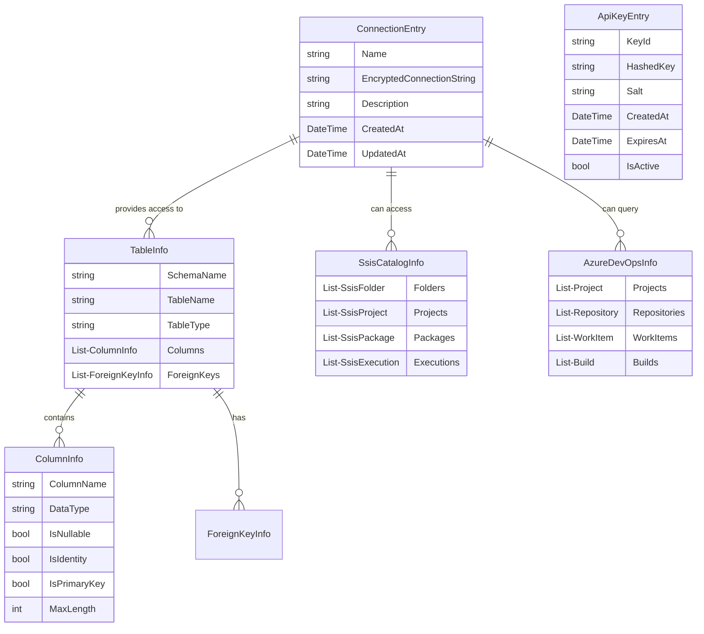

# SQL Server MCP Application - Mermaid Dataflows

Based on the analysis of the C# files from the mssqlMCP project, here are the key dataflow diagrams:

## 1. Overall System Architecture

## 2. Connection Management Flow

## 3. Database Metadata Retrieval Flow

## 4. Security & Authentication Flow

## 5. Encryption Service Flow

## 6. SSIS Integration Flow

## 7. Data Models Relationship

## Key Components Summary

1. **ConnectionManager**: Handles database connection lifecycle
2. **DatabaseMetadataProvider**: Core service for retrieving database schema information
3. **EncryptionService**: Secures connection strings using AES encryption
4. **ApiKeyManager**: Handles API authentication and authorization
5. **SSIS Integration**: Provides access to SQL Server Integration Services catalog
6. **Azure DevOps Integration**: Connects to Azure DevOps for project information

The application follows a clean architecture pattern with clear separation of concerns, proper error handling, and comprehensive logging throughout the data flow.
