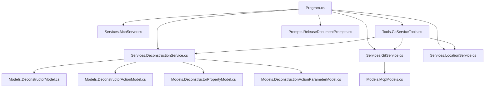

# GitVisionMCP Release Documentation

## Version and Release Date

- **Application Name:** GitVisionMCP
- **Version:** 1.0.5
- **Release Date:** July 26, 2025
- **Current Branch:** deconstructor

---

## Summary of Changes

This release includes improvements to MCP tool coverage, enhanced documentation generation, and robust deconstruction features for C# services, repositories, and controllers. No differences were found between the `deconstructor` and `master` branches.

---

## New Features

- **Deconstruction Tools:**

  - Deconstruct C# Service, Repository, or Controller files and output their structure as JSON.
  - Save deconstruction analysis directly to a JSON file in the workspace.

- **Branch and Commit Comparison:**

  - Compare branches and commits, generating documentation in markdown, HTML, or text formats.
  - Support for remote branch comparison with optional fetch.

- **Workspace File Analysis:**

  - List and filter workspace files by type, path, and modification date.
  - Read contents of filtered files, with binary and size checks.

- **Sampling LLM Integration:**
  - Run sampling chat using predefined user and system prompts.

---

## Enhancements

- Improved error handling and logging across all MCP tools.
- Output format validation for documentation generation.
- Directory existence checks before file operations.
- Enhanced filtering and performance for workspace file listing.

---

## Bug Fixes

- Fixed issues with file not found and binary file detection.
- Improved robustness in commit and branch comparison tools.
- Addressed edge cases in workspace file filtering and reading.

---

## Breaking Changes

- None reported for this release.

---

## Deprecated Features

- None reported for this release.

---

## Known Issues

- Large binary files are skipped in workspace file reading.
- Some edge cases in file filtering may require manual review.

---

## Installation/Upgrade Instructions

1. Ensure you are in a valid git repository.
2. Use the provided `mcp.json` configuration for VS Code Copilot Agent integration.
3. Build the project using:
   ```
   dotnet build
   ```
4. Run the MCP server with:
   ```
   dotnet run --project c:\Users\U00001\source\repos\MCP\GitVisionMCP\GitVisionMCP.csproj --no-build --verbosity quiet
   ```
5. For Docker, use the configuration in `.vscode/mcp.json`.

---

## MCP Tools Available in This Release

| Tool Name                             | Description                                                                   |
| ------------------------------------- | ----------------------------------------------------------------------------- |
| FetchFromRemoteAsync                  | Fetch latest changes from remote repository                                   |
| GenerateGitDocumentationAsync         | Generate documentation from git logs for the current workspace                |
| GenerateGitDocumentationToFileAsync   | Generate documentation from git logs and write to a file                      |
| CompareBranchesDocumentationAsync     | Generate documentation comparing differences between two branches             |
| CompareBranchesWithRemote             | Generate documentation comparing differences between two branches with remote |
| CompareCommitsDocumentation           | Generate documentation comparing differences between two commits              |
| GetRecentCommitsAsync                 | Get recent commits from the current repository                                |
| GetLocalBranchesAsync                 | Get list of local branches in the repository                                  |
| GetRemoteBranchesAsync                | Get list of remote branches in the repository                                 |
| GetAllBranchesAsync                   | Get list of all branches (local and remote) in the repository                 |
| GetCurrentBranchAsync                 | Get the current active branch in the repository                               |
| GetChangedFilesBetweenCommits         | Get list of files changed between two commits                                 |
| GetCommitDiffInfo                     | Get comprehensive diff information between two commits                        |
| GetDetailedDiffBetweenCommits         | Get detailed diff content between two commits                                 |
| SearchCommitsForStringAsync           | Search all commits for a specific string                                      |
| GetFileLineDiffBetweenCommits         | Get line-by-line file diff between two commits                                |
| ListWorkspaceFilesAsync               | List all files in the workspace with optional filtering                       |
| ListWorkspaceFilesWithCachedDataAsync | List workspace files with optional filtering using cached data                |
| ReadFilteredWorkspaceFilesAsync       | Read contents of all files from filtered workspace results                    |
| SearchJsonFileAsync                   | Search for JSON values in a JSON file using JSONPath                          |
| SearchXmlFileAsync                    | Search for XML values in an XML file using XPath                              |
| TransformXmlWithXsltAsync             | Transform an XML file using an XSLT stylesheet                                |
| SearchYamlFileAsync                   | Search for YAML values in a YAML file using JSONPath                          |
| DeconstructAsync                      | Deconstruct a C# Service, Repository or Controller file as JSON               |
| DeconstructToJsonAsync                | Deconstruct a C# file and save structure to a JSON file                       |
| SamplingLLM                           | Run Sampling chat to process predefined User and System prompts               |

---

## Workspace Architecture (Mermaid Flowchart)



---

## Commit: ef817e4b

**Author:** 7045kHz <7mhz.cw@gmail.com>
**Date:** 2025-07-26 15:03:25

**Message:**

```
Adding ArchitectureModel and refactoring deconstruction

```

**Changed Files:**

- Models/DeconstructorModel.cs
- Services/DeconstructionService.cs

**Changes:**

- Modified: Models/DeconstructorModel.cs
- Modified: Services/DeconstructionService.cs

---

## Commit: 7c4dc720

**Author:** 7045kHz <7mhz.cw@gmail.com>
**Date:** 2025-07-26 14:41:11

**Message:**

```
Move from Analysis of controller to Deconstructor

```

**Changed Files:**

- Models/DeconstructionActionParameterModel.cs
- Models/DeconstructorActionModel.cs
- Models/DeconstructorModel.cs
- Models/DeconstructorPropertyModel.cs
- Services/DeconstructionService.cs
- Services/IDeconstructionService.cs
- Services/McpServer.cs
- Tools/GitServiceTools.cs
- Tools/IGitServiceTools.cs

**Changes:**

- Added: Models/DeconstructionActionParameterModel.cs
- Added: Models/DeconstructorActionModel.cs
- Added: Models/DeconstructorModel.cs
- Added: Models/DeconstructorPropertyModel.cs
- Modified: Services/DeconstructionService.cs
- Modified: Services/IDeconstructionService.cs
- Modified: Services/McpServer.cs
- Modified: Tools/GitServiceTools.cs
- Modified: Tools/IGitServiceTools.cs

---

## Commit: 0336a7c9

**Author:** 7045kHz <66392808+7045kHz@users.noreply.github.com>
**Date:** 2025-07-24 17:03:05

**Message:**

```
Merge pull request #33 from MCPRUNNER/file_exists_issue

Updating GitServiceTools and GitServiceToolsTests with FullPath fix
```

**Changed Files:**

- GitVisionMCP.Tests/Tools/GitServiceToolsTests.cs
- Tools/GitServiceTools.Exclude.cs
- Tools/GitServiceTools.cs

**Changes:**

- Modified: GitVisionMCP.Tests/Tools/GitServiceToolsTests.cs
- Deleted: Tools/GitServiceTools.Exclude.cs
- Modified: Tools/GitServiceTools.cs

---

## Commit: f07f10c6

**Author:** 7045kHz <7mhz.cw@gmail.com>
**Date:** 2025-07-24 17:02:23

**Message:**

```
Updating GitServiceTools and GitServiceToolsTests with FullPath fix

```

**Changed Files:**

- GitVisionMCP.Tests/Tools/GitServiceToolsTests.cs
- Tools/GitServiceTools.Exclude.cs
- Tools/GitServiceTools.cs

**Changes:**

- Modified: GitVisionMCP.Tests/Tools/GitServiceToolsTests.cs
- Deleted: Tools/GitServiceTools.Exclude.cs
- Modified: Tools/GitServiceTools.cs

---

## Commit: 1ea6d097

**Author:** 7045kHz <66392808+7045kHz@users.noreply.github.com>
**Date:** 2025-07-23 18:59:57

**Message:**

```
Merge pull request #32 from MCPRUNNER/file_exists_issue

Adding locationService.GetFullPath to resolve issues with relative pa…
```

**Changed Files:**

- Services/ILocationService.cs
- Services/LocationService.cs

**Changes:**

- Modified: Services/ILocationService.cs
- Modified: Services/LocationService.cs

---

## Commit: 7507c8b8

**Author:** 7045kHz <7mhz.cw@gmail.com>
**Date:** 2025-07-23 18:58:56

**Message:**

```
Adding locationService.GetFullPath to resolve issues with relative path sourcing

```

**Changed Files:**

- Services/ILocationService.cs
- Services/LocationService.cs

**Changes:**

- Modified: Services/ILocationService.cs
- Modified: Services/LocationService.cs

---

## Commit: 46064e82

**Author:** 7045kHz <66392808+7045kHz@users.noreply.github.com>
**Date:** 2025-07-23 08:09:00

**Message:**

```
Merge pull request #31 from MCPRUNNER/xlst_tool

Resolving file.exists issue in exclude configuration
```

**Changed Files:**

- Services/LocationService.cs
- Services/McpServer.cs

**Changes:**

- Modified: Services/LocationService.cs
- Modified: Services/McpServer.cs

---

## Commit: a3b386d5

**Author:** 7045kHz <7mhz.cw@gmail.com>
**Date:** 2025-07-23 08:07:58

**Message:**

```
Resolving file.exists issue in exclude configuration

```

**Changed Files:**

- Services/LocationService.cs
- Services/McpServer.cs

**Changes:**

- Modified: Services/LocationService.cs
- Modified: Services/McpServer.cs

---

## Commit: 26b405d2

**Author:** 7045kHz <66392808+7045kHz@users.noreply.github.com>
**Date:** 2025-07-22 20:23:50

**Message:**

```
Merge pull request #30 from MCPRUNNER/xlst_tool

Xlst tool
```

**Changed Files:**

- Documentation/ControllerArchitecture.mmd
- README.md

**Changes:**

- Added: Documentation/ControllerArchitecture.mmd
- Modified: README.md

---

## Commit: f7de4632

**Author:** 7045kHz <7mhz.cw@gmail.com>
**Date:** 2025-07-22 20:21:32

**Message:**

```
Updating documentation

```

**Changed Files:**

- Documentation/ControllerArchitecture.mmd

**Changes:**

- Added: Documentation/ControllerArchitecture.mmd

---

## Commit: 37fb15e8

**Author:** 7045kHz <7mhz.cw@gmail.com>
**Date:** 2025-07-22 20:19:29

**Message:**

```
Updating documentation

```

**Changed Files:**

- README.md

**Changes:**

- Modified: README.md

---

## Commit: b4b268c6

**Author:** 7045kHz <66392808+7045kHz@users.noreply.github.com>
**Date:** 2025-07-22 20:09:21

**Message:**

```
Merge pull request #29 from MCPRUNNER/xlst_tool

Adding XSLT Processing of XML file
```

**Changed Files:**

- GitVisionMCP.Tests/Services/LocationServiceTests.cs
- GitVisionMCP.Tests/Tools/GitServiceToolsTests.cs
- README.md
- Services/ILocationService.cs
- Services/LocationService.cs
- TODO.md
- Tools/GitServiceTools.cs
- simple-transform.xslt
- test-data.xml
- transform-to-html.xslt

**Changes:**

- Modified: GitVisionMCP.Tests/Services/LocationServiceTests.cs
- Modified: GitVisionMCP.Tests/Tools/GitServiceToolsTests.cs
- Modified: README.md
- Modified: Services/ILocationService.cs
- Modified: Services/LocationService.cs
- Modified: TODO.md
- Modified: Tools/GitServiceTools.cs
- Added: simple-transform.xslt
- Added: test-data.xml
- Added: transform-to-html.xslt

---

## Commit: 45f31ab8

**Author:** 7045kHz <7mhz.cw@gmail.com>
**Date:** 2025-07-22 20:07:05

**Message:**

```
Adding XSLT Processing of XML file

```

**Changed Files:**

- GitVisionMCP.Tests/Services/LocationServiceTests.cs
- GitVisionMCP.Tests/Tools/GitServiceToolsTests.cs
- README.md
- Services/ILocationService.cs
- Services/LocationService.cs
- TODO.md
- Tools/GitServiceTools.cs
- simple-transform.xslt
- test-data.xml
- transform-to-html.xslt

**Changes:**

- Modified: GitVisionMCP.Tests/Services/LocationServiceTests.cs
- Modified: GitVisionMCP.Tests/Tools/GitServiceToolsTests.cs
- Modified: README.md
- Modified: Services/ILocationService.cs
- Modified: Services/LocationService.cs
- Modified: TODO.md
- Modified: Tools/GitServiceTools.cs
- Added: simple-transform.xslt
- Added: test-data.xml
- Added: transform-to-html.xslt

---

## Commit: bdcf92ea

**Author:** 7045kHz <66392808+7045kHz@users.noreply.github.com>
**Date:** 2025-07-22 19:45:05

**Message:**

```
Merge pull request #28 from MCPRUNNER/yaml_search

Yaml search
```

**Changed Files:**

- Documentation/EXAMPLES.md
- GitVisionMCP.Tests/Services/LocationServiceTests.cs
- GitVisionMCP.Tests/Tools/GitServiceToolsTests.cs
- GitVisionMCP.csproj
- README.md
- Services/ILocationService.cs
- Services/LocationService.cs
- TODO.md
- Tools/GitServiceTools.cs
- test-config.yaml

**Changes:**

- Modified: Documentation/EXAMPLES.md
- Modified: GitVisionMCP.Tests/Services/LocationServiceTests.cs
- Modified: GitVisionMCP.Tests/Tools/GitServiceToolsTests.cs
- Modified: GitVisionMCP.csproj
- Modified: README.md
- Modified: Services/ILocationService.cs
- Modified: Services/LocationService.cs
- Modified: TODO.md
- Modified: Tools/GitServiceTools.cs
- Added: test-config.yaml

---

## Commit: e4c7ae32

**Author:** 7045kHz <7mhz.cw@gmail.com>
**Date:** 2025-07-22 19:38:29

**Message:**

```
Merge branch 'master' into yaml_search

```

**Changed Files:**

- Services/LocationService.cs
- Tools/GitServiceTools.cs

**Changes:**

- Modified: Services/LocationService.cs
- Modified: Tools/GitServiceTools.cs

---

## Commit: 7df40aca

**Author:** 7045kHz <7mhz.cw@gmail.com>
**Date:** 2025-07-22 19:37:55

**Message:**

```
Adding YAML processing

```

**Changed Files:**

- Documentation/EXAMPLES.md
- GitVisionMCP.Tests/Services/LocationServiceTests.cs
- GitVisionMCP.Tests/Tools/GitServiceToolsTests.cs
- GitVisionMCP.csproj
- README.md
- Services/ILocationService.cs
- Services/LocationService.cs
- TODO.md
- Tools/GitServiceTools.cs
- test-config.yaml

**Changes:**

- Modified: Documentation/EXAMPLES.md
- Modified: GitVisionMCP.Tests/Services/LocationServiceTests.cs
- Modified: GitVisionMCP.Tests/Tools/GitServiceToolsTests.cs
- Modified: GitVisionMCP.csproj
- Modified: README.md
- Modified: Services/ILocationService.cs
- Modified: Services/LocationService.cs
- Modified: TODO.md
- Modified: Tools/GitServiceTools.cs
- Added: test-config.yaml

---

## Commit: 45998a75

**Author:** 7045kHz <66392808+7045kHz@users.noreply.github.com>
**Date:** 2025-07-22 19:16:43

**Message:**

```
Merge pull request #27 from MCPRUNNER/cleanup

Adding exclusion lists to filesearches, and updating tests
```

**Changed Files:**

- .gitvision/exclude.json
- Documentation/ControllerArchitecture.mmd
- Documentation/EXAMPLES.md
- Documentation/EXCLUDE_FUNCTIONALITY.md
- Documentation/PROJECT_STATUS.md
- GitVisionMCP.Tests/Tools/GitServiceToolsTests.cs
- Models/ExcludeConfiguration.cs
- README.md
- RELEASE_NOTES.md
- Services/ILocationService.cs
- Services/LocationService.cs
- TODO.md
- Tools/GitServiceTools.Exclude.cs
- Tools/GitServiceTools.cs
- asp_controllers.template.xml

**Changes:**

- Added: .gitvision/exclude.json
- Deleted: Documentation/ControllerArchitecture.mmd
- Modified: Documentation/EXAMPLES.md
- Added: Documentation/EXCLUDE_FUNCTIONALITY.md
- Modified: Documentation/PROJECT_STATUS.md
- Modified: GitVisionMCP.Tests/Tools/GitServiceToolsTests.cs
- Added: Models/ExcludeConfiguration.cs
- Modified: README.md
- Modified: RELEASE_NOTES.md
- Modified: Services/ILocationService.cs
- Modified: Services/LocationService.cs
- Added: TODO.md
- Added: Tools/GitServiceTools.Exclude.cs
- Modified: Tools/GitServiceTools.cs
- Deleted: asp_controllers.template.xml

---

## Commit: 16a78c75

**Author:** 7045kHz <66392808+7045kHz@users.noreply.github.com>
**Date:** 2025-07-22 19:16:27

**Message:**

```
Update Services/LocationService.cs

Co-authored-by: Copilot <175728472+Copilot@users.noreply.github.com>
```

**Changed Files:**

- Services/LocationService.cs

**Changes:**

- Modified: Services/LocationService.cs

---

## Commit: 61d0c842

**Author:** 7045kHz <66392808+7045kHz@users.noreply.github.com>
**Date:** 2025-07-22 19:16:16

**Message:**

```
Update Services/LocationService.cs

Co-authored-by: Copilot <175728472+Copilot@users.noreply.github.com>
```

**Changed Files:**

- Services/LocationService.cs

**Changes:**

- Modified: Services/LocationService.cs

---

## Commit: f2f785df

**Author:** 7045kHz <66392808+7045kHz@users.noreply.github.com>
**Date:** 2025-07-22 19:16:06

**Message:**

```
Update Services/LocationService.cs

Co-authored-by: Copilot <175728472+Copilot@users.noreply.github.com>
```

**Changed Files:**

- Services/LocationService.cs

**Changes:**

- Modified: Services/LocationService.cs

---

## Commit: b71940ee

**Author:** 7045kHz <66392808+7045kHz@users.noreply.github.com>
**Date:** 2025-07-22 19:15:45

**Message:**

```
Update Tools/GitServiceTools.cs

Co-authored-by: Copilot <175728472+Copilot@users.noreply.github.com>
```

**Changed Files:**

- Tools/GitServiceTools.cs

**Changes:**

- Modified: Tools/GitServiceTools.cs

---

## Commit: 5eec80e3

**Author:** 7045kHz <7mhz.cw@gmail.com>
**Date:** 2025-07-22 19:12:24

**Message:**

```
Adding exclusion lists to filesearches, and updating tests

```

**Changed Files:**

- .gitvision/exclude.json
- Documentation/ControllerArchitecture.mmd
- Documentation/EXAMPLES.md
- Documentation/EXCLUDE_FUNCTIONALITY.md
- Documentation/PROJECT_STATUS.md
- GitVisionMCP.Tests/Tools/GitServiceToolsTests.cs
- Models/ExcludeConfiguration.cs
- README.md
- RELEASE_NOTES.md
- Services/ILocationService.cs
- Services/LocationService.cs
- TODO.md
- Tools/GitServiceTools.Exclude.cs
- Tools/GitServiceTools.cs
- asp_controllers.template.xml

**Changes:**

- Added: .gitvision/exclude.json
- Deleted: Documentation/ControllerArchitecture.mmd
- Modified: Documentation/EXAMPLES.md
- Added: Documentation/EXCLUDE_FUNCTIONALITY.md
- Modified: Documentation/PROJECT_STATUS.md
- Modified: GitVisionMCP.Tests/Tools/GitServiceToolsTests.cs
- Added: Models/ExcludeConfiguration.cs
- Modified: README.md
- Modified: RELEASE_NOTES.md
- Modified: Services/ILocationService.cs
- Modified: Services/LocationService.cs
- Added: TODO.md
- Added: Tools/GitServiceTools.Exclude.cs
- Modified: Tools/GitServiceTools.cs
- Deleted: asp_controllers.template.xml

---

## Commit: a9f24cf0

**Author:** 7045kHz <66392808+7045kHz@users.noreply.github.com>
**Date:** 2025-07-22 14:16:18

**Message:**

```
Merge pull request #26 from MCPRUNNER/cleanup

Cleanup
```

**Changed Files:**

- .github/prompts/document.controller.prompt.md
- .gitvision/prompt_templates/asp_controllers.template.xml
- Documentation/ControllerArchitecture.mmd
- Documentation/ControllerDocumentation.md
- Documentation/Example_mssqlMCP_Dataflows.md
- Documentation/SETUP.md
- Documentation/VS_CODE_INTEGRATION_FIXES.md
- SampleController.cs
- TestApp/Program.cs
- TestApp/TestApp.csproj
- TestUsersController.cs
- asp_controllers.template.xml
- test-attribute-search.cs
- test-data.json
- test-deconstruction.cs
- test_xml_search.cs

**Changes:**

- Added: .github/prompts/document.controller.prompt.md
- Added: .gitvision/prompt_templates/asp_controllers.template.xml
- Added: Documentation/ControllerArchitecture.mmd
- Added: Documentation/ControllerDocumentation.md
- Renamed: Documentation/Example_mssqlMCP_Dataflows.md
- Modified: Documentation/SETUP.md
- Modified: Documentation/VS_CODE_INTEGRATION_FIXES.md
- Deleted: SampleController.cs
- Deleted: TestApp/Program.cs
- Deleted: TestApp/TestApp.csproj
- Deleted: TestUsersController.cs
- Added: asp_controllers.template.xml
- Deleted: test-attribute-search.cs
- Modified: test-data.json
- Deleted: test-deconstruction.cs
- Deleted: test_xml_search.cs

---

## Commit: d9f1acbd

**Author:** 7045kHz <7mhz.cw@gmail.com>
**Date:** 2025-07-22 14:14:20

**Message:**

```
Testing controller prompt

```

**Changed Files:**

- .github/prompts/document.controller.prompt.md
- .gitvision/prompt_templates/asp_controllers.template.xml
- Documentation/ControllerArchitecture.mmd
- Documentation/ControllerDocumentation.md
- Documentation/VS_CODE_INTEGRATION_FIXES.md
- asp_controllers.template.xml
- test-data.json

**Changes:**

- Added: .github/prompts/document.controller.prompt.md
- Added: .gitvision/prompt_templates/asp_controllers.template.xml
- Added: Documentation/ControllerArchitecture.mmd
- Added: Documentation/ControllerDocumentation.md
- Added: Documentation/VS_CODE_INTEGRATION_FIXES.md
- Added: asp_controllers.template.xml
- Added: test-data.json

---

## Commit: 1d885261

**Author:** 7045kHz <7mhz.cw@gmail.com>
**Date:** 2025-07-19 17:06:58

**Message:**

```
Updating SETUP.md and cleanup unused files

```

**Changed Files:**

- Documentation/Example_mssqlMCP_Dataflows.md
- Documentation/SETUP.md
- Documentation/VS_CODE_INTEGRATION_FIXES.md
- SampleController.cs
- TestApp/Program.cs
- TestApp/TestApp.csproj
- TestUsersController.cs
- test-attribute-search.cs
- test-data.json
- test-deconstruction.cs
- test_xml_search.cs

**Changes:**

- Renamed: Documentation/Example_mssqlMCP_Dataflows.md
- Modified: Documentation/SETUP.md
- Deleted: Documentation/VS_CODE_INTEGRATION_FIXES.md
- Deleted: SampleController.cs
- Deleted: TestApp/Program.cs
- Deleted: TestApp/TestApp.csproj
- Deleted: TestUsersController.cs
- Deleted: test-attribute-search.cs
- Deleted: test-data.json
- Deleted: test-deconstruction.cs
- Deleted: test_xml_search.cs

---

## Commit: 4af37f50

**Author:** 7045kHz <66392808+7045kHz@users.noreply.github.com>
**Date:** 2025-07-19 16:49:58

**Message:**

```
Merge pull request #25 from MCPRUNNER/github_prompt_addons

GitHub prompt addons
```

**Changed Files:**

- .github/prompts/document.ansible.prompt.md
- .github/prompts/document.csharp.prompt.md
- .github/prompts/document.golang.prompt.md
- .github/prompts/document.liquibase.prompt.md
- .github/prompts/document.python.prompt.md
- AI.Prompts/Ansible_Infrastructure_Documentation_Prompt.md
- AI.Prompts/CSharp_Application_Documentation_Prompt.md
- AI.Prompts/Go_Application_Documentation_Prompt.md
- AI.Prompts/Python_Application_Documentation_Prompt.md
- AI.Prompts/SQL_Liquibase_Documentation_Prompt.md
- TestApp/Program.cs
- TestApp/TestApp.csproj
- TestUsersController.cs
- test-attribute-search.cs
- test-deconstruction.cs
- test_xml_search.cs

**Changes:**

- Added: .github/prompts/document.ansible.prompt.md
- Added: .github/prompts/document.csharp.prompt.md
- Added: .github/prompts/document.golang.prompt.md
- Added: .github/prompts/document.liquibase.prompt.md
- Added: .github/prompts/document.python.prompt.md
- Added: AI.Prompts/Ansible_Infrastructure_Documentation_Prompt.md
- Added: AI.Prompts/CSharp_Application_Documentation_Prompt.md
- Added: AI.Prompts/Go_Application_Documentation_Prompt.md
- Added: AI.Prompts/Python_Application_Documentation_Prompt.md
- Added: AI.Prompts/SQL_Liquibase_Documentation_Prompt.md
- Added: TestApp/Program.cs
- Added: TestApp/TestApp.csproj
- Added: TestUsersController.cs
- Added: test-attribute-search.cs
- Added: test-deconstruction.cs
- Added: test_xml_search.cs

---

## Commit: 07a868bb

**Author:** 7045kHz <66392808+7045kHz@users.noreply.github.com>
**Date:** 2025-07-19 16:49:42

**Message:**

```
Update .github/prompts/document.csharp.prompt.md

Co-authored-by: Copilot <175728472+Copilot@users.noreply.github.com>
```

**Changed Files:**

- .github/prompts/document.csharp.prompt.md

**Changes:**

- Modified: .github/prompts/document.csharp.prompt.md

---

## Commit: 88d3ba8f

**Author:** 7045kHz <7mhz.cw@gmail.com>
**Date:** 2025-07-19 16:46:48

**Message:**

```
setting default documentation for .github/prompts in the workspace Documentation directory

```

**Changed Files:**

- .github/prompts/document.ansible.prompt.md
- .github/prompts/document.csharp.prompt.md
- .github/prompts/document.golang.prompt.md
- .github/prompts/document.liquibase.prompt.md
- .github/prompts/document.python.prompt.md

**Changes:**

- Modified: .github/prompts/document.ansible.prompt.md
- Modified: .github/prompts/document.csharp.prompt.md
- Modified: .github/prompts/document.golang.prompt.md
- Modified: .github/prompts/document.liquibase.prompt.md
- Modified: .github/prompts/document.python.prompt.md

---

## Commit: 51939a03

**Author:** 7045kHz <7mhz.cw@gmail.com>
**Date:** 2025-07-19 16:44:04

**Message:**

```
Adding stock .github/prompts for documenting common language repositories

```

**Changed Files:**

- .github/prompts/document.ansible.prompt.md
- .github/prompts/document.csharp.prompt.md
- .github/prompts/document.golang.prompt.md
- .github/prompts/document.liquibase.prompt.md
- .github/prompts/document.python.prompt.md
- AI.Prompts/Ansible_Infrastructure_Documentation_Prompt.md
- AI.Prompts/CSharp_Application_Documentation_Prompt.md
- AI.Prompts/Go_Application_Documentation_Prompt.md
- AI.Prompts/Python_Application_Documentation_Prompt.md
- AI.Prompts/SQL_Liquibase_Documentation_Prompt.md
- TestApp/Program.cs
- TestApp/TestApp.csproj
- TestUsersController.cs
- test-attribute-search.cs
- test-deconstruction.cs
- test_xml_search.cs

**Changes:**

- Added: .github/prompts/document.ansible.prompt.md
- Added: .github/prompts/document.csharp.prompt.md
- Added: .github/prompts/document.golang.prompt.md
- Added: .github/prompts/document.liquibase.prompt.md
- Added: .github/prompts/document.python.prompt.md
- Added: AI.Prompts/Ansible_Infrastructure_Documentation_Prompt.md
- Added: AI.Prompts/CSharp_Application_Documentation_Prompt.md
- Added: AI.Prompts/Go_Application_Documentation_Prompt.md
- Added: AI.Prompts/Python_Application_Documentation_Prompt.md
- Added: AI.Prompts/SQL_Liquibase_Documentation_Prompt.md
- Added: TestApp/Program.cs
- Added: TestApp/TestApp.csproj
- Added: TestUsersController.cs
- Added: test-attribute-search.cs
- Added: test-deconstruction.cs
- Added: test_xml_search.cs

---

## Commit: 606b2441

**Author:** 7045kHz <66392808+7045kHz@users.noreply.github.com>
**Date:** 2025-07-19 10:22:19

**Message:**

```
Merge pull request #24 from MCPRUNNER/deconstructor

Deconstructor
```

**Changed Files:**

- .github/prompts/ReleaseNotesPrompt.md
- Documentation/DECONSTRUCTION_SERVICE.md
- GitVisionMCP.Tests/Tools/GitServiceToolsTests.cs
- Program.cs
- SampleController.cs
- Services/DeconstructionService.cs
- Services/IDeconstructionService.cs
- Services/McpServer.cs
- Tools/GitServiceTools.cs
- Tools/IGitServiceTools.cs

**Changes:**

- Added: .github/prompts/ReleaseNotesPrompt.md
- Added: Documentation/DECONSTRUCTION_SERVICE.md
- Modified: GitVisionMCP.Tests/Tools/GitServiceToolsTests.cs
- Modified: Program.cs
- Added: SampleController.cs
- Added: Services/DeconstructionService.cs
- Added: Services/IDeconstructionService.cs
- Modified: Services/McpServer.cs
- Modified: Tools/GitServiceTools.cs
- Modified: Tools/IGitServiceTools.cs

---

## Commit: f1b52a39

**Author:** 7045kHz <66392808+7045kHz@users.noreply.github.com>
**Date:** 2025-07-19 10:21:43

**Message:**

```
Update Services/DeconstructionService.cs

Co-authored-by: Copilot <175728472+Copilot@users.noreply.github.com>
```

**Changed Files:**

- Services/DeconstructionService.cs

**Changes:**

- Modified: Services/DeconstructionService.cs

---

## Commit: e4d6837e

**Author:** 7045kHz <66392808+7045kHz@users.noreply.github.com>
**Date:** 2025-07-19 10:21:36

**Message:**

```
Update Tools/GitServiceTools.cs

Co-authored-by: Copilot <175728472+Copilot@users.noreply.github.com>
```

**Changed Files:**

- Tools/GitServiceTools.cs

**Changes:**

- Modified: Tools/GitServiceTools.cs

---

## Commit: 19dea235

**Author:** 7045kHz <7mhz.cw@gmail.com>
**Date:** 2025-07-19 10:11:48

**Message:**

```
Updating tests

```

**Changed Files:**

- .github/prompts/ReleaseNotesPrompt.md
- GitVisionMCP.Tests/Tools/GitServiceToolsTests.cs
- Services/DeconstructionService.cs
- Services/IDeconstructionService.cs
- Services/McpServer.cs
- Tools/GitServiceTools.cs
- Tools/IGitServiceTools.cs

**Changes:**

- Added: .github/prompts/ReleaseNotesPrompt.md
- Modified: GitVisionMCP.Tests/Tools/GitServiceToolsTests.cs
- Modified: Services/DeconstructionService.cs
- Modified: Services/IDeconstructionService.cs
- Modified: Services/McpServer.cs
- Modified: Tools/GitServiceTools.cs
- Modified: Tools/IGitServiceTools.cs

---

## Commit: 697a825d

**Author:** 7045kHz <7mhz.cw@gmail.com>
**Date:** 2025-07-19 08:40:44

**Message:**

```
clearing test controller files

```

**Changed Files:**

- TestUsersController.cs
- test-deconstruction.cs

**Changes:**

- Deleted: TestUsersController.cs
- Deleted: test-deconstruction.cs

---

## Commit: eebebe97

**Author:** 7045kHz <7mhz.cw@gmail.com>
**Date:** 2025-07-19 08:39:09

**Message:**

```
Adding deconstructor service with method for ASP.NET controller to json tool

```

**Changed Files:**

- Documentation/DECONSTRUCTION_SERVICE.md
- GitVisionMCP.Tests/Tools/GitServiceToolsTests.cs
- Program.cs
- SampleController.cs
- Services/DeconstructionService.cs
- Services/IDeconstructionService.cs
- Services/McpServer.cs
- TestUsersController.cs
- Tools/GitServiceTools.cs
- Tools/IGitServiceTools.cs
- test-deconstruction.cs

**Changes:**

- Added: Documentation/DECONSTRUCTION_SERVICE.md
- Modified: GitVisionMCP.Tests/Tools/GitServiceToolsTests.cs
- Modified: Program.cs
- Added: SampleController.cs
- Added: Services/DeconstructionService.cs
- Added: Services/IDeconstructionService.cs
- Modified: Services/McpServer.cs
- Added: TestUsersController.cs
- Modified: Tools/GitServiceTools.cs
- Modified: Tools/IGitServiceTools.cs
- Added: test-deconstruction.cs

---

## Commit: 59b5dbbb

**Author:** 7045kHz <66392808+7045kHz@users.noreply.github.com>
**Date:** 2025-07-19 08:18:09

**Message:**

```
Merge pull request #23 from MCPRUNNER/content_read_fix

SearchXmlFile tool
```

**Changed Files:**

- Documentation/EXAMPLES.md
- Documentation/VS_CODE_INTEGRATION_FIXES.md
- Documentation/XML_SEARCH_IMPLEMENTATION.md
- Program.cs
- README.md
- Services/ILocationService.cs
- Services/LocationService.cs
- Services/McpServer.cs
- Tools/GitServiceTools.cs
- Tools/IGitServiceTools.cs
- test-attributes.xml
- test-config.xml

**Changes:**

- Modified: Documentation/EXAMPLES.md
- Added: Documentation/VS_CODE_INTEGRATION_FIXES.md
- Added: Documentation/XML_SEARCH_IMPLEMENTATION.md
- Modified: Program.cs
- Modified: README.md
- Modified: Services/ILocationService.cs
- Modified: Services/LocationService.cs
- Modified: Services/McpServer.cs
- Modified: Tools/GitServiceTools.cs
- Modified: Tools/IGitServiceTools.cs
- Added: test-attributes.xml
- Added: test-config.xml

---

## Commit: cc6061e7

**Author:** 7045kHz <7mhz.cw@gmail.com>
**Date:** 2025-07-19 08:05:54

**Message:**

```
Adding SearchXmlFile tool documentation and XPath testing

```

**Changed Files:**

- Documentation/VS_CODE_INTEGRATION_FIXES.md
- Program.cs
- README.md
- Services/LocationService.cs
- test-attributes.xml

**Changes:**

- Added: Documentation/VS_CODE_INTEGRATION_FIXES.md
- Modified: Program.cs
- Modified: README.md
- Modified: Services/LocationService.cs
- Added: test-attributes.xml

---

## Commit: 4fdb3418

**Author:** 7045kHz <7mhz.cw@gmail.com>
**Date:** 2025-07-19 07:58:45

**Message:**

```
Adding SearchXmlFile tool

```

**Changed Files:**

- Documentation/EXAMPLES.md
- Documentation/XML_SEARCH_IMPLEMENTATION.md
- README.md

**Changes:**

- Modified: Documentation/EXAMPLES.md
- Modified: Documentation/XML_SEARCH_IMPLEMENTATION.md
- Modified: README.md

---

## Commit: 10fc8a17

**Author:** 7045kHz <7mhz.cw@gmail.com>
**Date:** 2025-07-19 07:58:35

**Message:**

```
Adding SearchXmlFile tool

```

**Changed Files:**

- Documentation/EXAMPLES.md
- Documentation/XML_SEARCH_IMPLEMENTATION.md
- README.md
- Services/ILocationService.cs
- Services/LocationService.cs
- Services/McpServer.cs
- Tools/GitServiceTools.cs
- Tools/IGitServiceTools.cs
- test-config.xml

**Changes:**

- Modified: Documentation/EXAMPLES.md
- Added: Documentation/XML_SEARCH_IMPLEMENTATION.md
- Modified: README.md
- Modified: Services/ILocationService.cs
- Modified: Services/LocationService.cs
- Modified: Services/McpServer.cs
- Modified: Tools/GitServiceTools.cs
- Modified: Tools/IGitServiceTools.cs
- Added: test-config.xml

---

## Commit: 388e5de4

**Author:** 7045kHz <66392808+7045kHz@users.noreply.github.com>
**Date:** 2025-07-18 21:20:45

**Message:**

```
Merge pull request #22 from MCPRUNNER/search_improvements

SearchJsonFile tool added
```

**Changed Files:**

- Documentation/EXAMPLES.md
- Documentation/PROJECT_STATUS.md
- GitVisionMCP.Tests/Services/McpServerTests.cs
- GitVisionMCP.Tests/Tools/GitServiceToolsTests.cs
- GitVisionMCP.csproj
- README.md
- Services/ILocationService.cs
- Services/LocationService.cs
- Services/McpServer.cs
- Tools/GitServiceTools.cs
- Tools/IGitServiceTools.cs
- test-data.json

**Changes:**

- Modified: Documentation/EXAMPLES.md
- Modified: Documentation/PROJECT_STATUS.md
- Modified: GitVisionMCP.Tests/Services/McpServerTests.cs
- Modified: GitVisionMCP.Tests/Tools/GitServiceToolsTests.cs
- Modified: GitVisionMCP.csproj
- Modified: README.md
- Modified: Services/ILocationService.cs
- Modified: Services/LocationService.cs
- Modified: Services/McpServer.cs
- Modified: Tools/GitServiceTools.cs
- Modified: Tools/IGitServiceTools.cs
- Added: test-data.json

---

## Commit: f189814f

**Author:** 7045kHz <66392808+7045kHz@users.noreply.github.com>
**Date:** 2025-07-18 21:20:28

**Message:**

```
Update Services/LocationService.cs

Co-authored-by: Copilot <175728472+Copilot@users.noreply.github.com>
```

**Changed Files:**

- Services/LocationService.cs

**Changes:**

- Modified: Services/LocationService.cs

---

## Commit: a7db77d9

**Author:** 7045kHz <66392808+7045kHz@users.noreply.github.com>
**Date:** 2025-07-18 21:19:39

**Message:**

```
Update Services/LocationService.cs

Co-authored-by: Copilot <175728472+Copilot@users.noreply.github.com>
```

**Changed Files:**

- Services/LocationService.cs

**Changes:**

- Modified: Services/LocationService.cs

---

## Commit: 7597a5e4

**Author:** 7045kHz <66392808+7045kHz@users.noreply.github.com>
**Date:** 2025-07-18 21:19:33

**Message:**

```
Update Services/LocationService.cs

Co-authored-by: Copilot <175728472+Copilot@users.noreply.github.com>
```

**Changed Files:**

- Services/LocationService.cs

**Changes:**

- Modified: Services/LocationService.cs

---

## Commit: 7ddae3e1

**Author:** 7045kHz <7mhz.cw@gmail.com>
**Date:** 2025-07-18 21:16:19

**Message:**

```
Added tool to process and search Json

```

**Changed Files:**

- Documentation/EXAMPLES.md
- README.md
- Services/ILocationService.cs
- Services/McpServer.cs
- Tools/GitServiceTools.cs
- Tools/IGitServiceTools.cs

**Changes:**

- Modified: Documentation/EXAMPLES.md
- Modified: README.md
- Modified: Services/ILocationService.cs
- Modified: Services/McpServer.cs
- Modified: Tools/GitServiceTools.cs
- Modified: Tools/IGitServiceTools.cs

---

## Commit: d36697b3

**Author:** 7045kHz <7mhz.cw@gmail.com>
**Date:** 2025-07-18 21:04:40

**Message:**

```
Added tool to process and search Json

```

**Changed Files:**

- Documentation/EXAMPLES.md
- Documentation/PROJECT_STATUS.md
- GitVisionMCP.Tests/Services/McpServerTests.cs
- GitVisionMCP.Tests/Tools/GitServiceToolsTests.cs
- GitVisionMCP.csproj
- README.md
- Services/ILocationService.cs
- Services/LocationService.cs
- Services/McpServer.cs
- Tools/GitServiceTools.cs
- Tools/IGitServiceTools.cs
- test-data.json

**Changes:**

- Modified: Documentation/EXAMPLES.md
- Modified: Documentation/PROJECT_STATUS.md
- Modified: GitVisionMCP.Tests/Services/McpServerTests.cs
- Modified: GitVisionMCP.Tests/Tools/GitServiceToolsTests.cs
- Modified: GitVisionMCP.csproj
- Modified: README.md
- Modified: Services/ILocationService.cs
- Modified: Services/LocationService.cs
- Modified: Services/McpServer.cs
- Modified: Tools/GitServiceTools.cs
- Modified: Tools/IGitServiceTools.cs
- Added: test-data.json

---

## Commit: d830938d

**Author:** 7045kHz <66392808+7045kHz@users.noreply.github.com>
**Date:** 2025-07-18 07:43:33

**Message:**

```
Merge pull request #21 from MCPRUNNER/search_improvements

Updating ReadFilteredWorkspaceFiles with search pattern
```

**Changed Files:**

- Documentation/PROJECT_STATUS.md
- GitVisionMCP.Tests/Services/LocationServiceTests.cs
- README.md
- RELEASE_NOTES_FINAL.md
- Services/GitService.cs
- Services/ILocationService.cs
- Services/LocationService.cs
- Services/McpServer.cs
- Tools/GitServiceTools.cs

**Changes:**

- Modified: Documentation/PROJECT_STATUS.md
- Modified: GitVisionMCP.Tests/Services/LocationServiceTests.cs
- Modified: README.md
- Deleted: RELEASE_NOTES_FINAL.md
- Modified: Services/GitService.cs
- Modified: Services/ILocationService.cs
- Modified: Services/LocationService.cs
- Modified: Services/McpServer.cs
- Modified: Tools/GitServiceTools.cs

---

## Commit: 7ad25ff6

**Author:** 7045kHz <7mhz.cw@gmail.com>
**Date:** 2025-07-18 07:36:45

**Message:**

```
Updating ReadFilteredWorkspaceFiles with search pattern

```

**Changed Files:**

- Documentation/PROJECT_STATUS.md
- GitVisionMCP.Tests/Services/LocationServiceTests.cs
- README.md
- RELEASE_NOTES_FINAL.md
- Services/GitService.cs
- Services/ILocationService.cs
- Services/LocationService.cs
- Services/McpServer.cs
- Tools/GitServiceTools.cs

**Changes:**

- Modified: Documentation/PROJECT_STATUS.md
- Modified: GitVisionMCP.Tests/Services/LocationServiceTests.cs
- Modified: README.md
- Deleted: RELEASE_NOTES_FINAL.md
- Modified: Services/GitService.cs
- Modified: Services/ILocationService.cs
- Modified: Services/LocationService.cs
- Modified: Services/McpServer.cs
- Modified: Tools/GitServiceTools.cs

---

## Commit: e8987ba0

**Author:** 7045kHz <66392808+7045kHz@users.noreply.github.com>
**Date:** 2025-07-17 20:40:24

**Message:**

```
Merge pull request #20 from MCPRUNNER/prompt_loading

Prompt loading
```

**Changed Files:**

- Services/ILocationService.cs
- Services/LocationService.cs
- src/Tools/DocumentationTool.cs

**Changes:**

- Modified: Services/ILocationService.cs
- Modified: Services/LocationService.cs
- Deleted: src/Tools/DocumentationTool.cs

---

## Commit: 7be081e9

**Author:** 7045kHz <7mhz.cw@gmail.com>
**Date:** 2025-07-17 20:38:40

**Message:**

```
Committing filePath change

```

---
