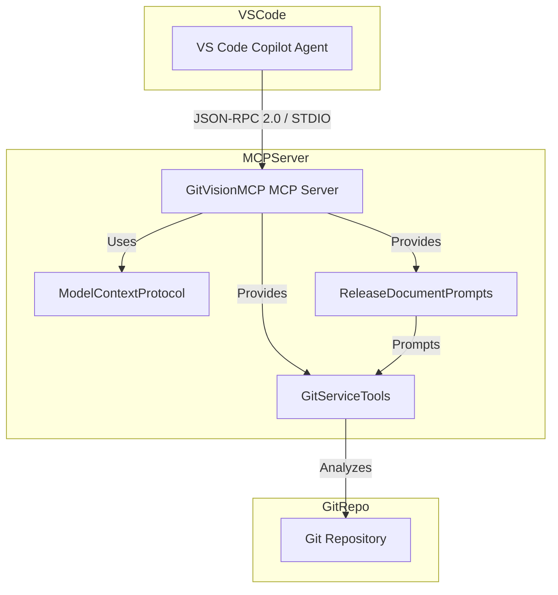

# GitVisionMCP Release Document

**Version:** 1.0.5  
**Release Date:** 2025-07-26  
**Current Branch:** deconstructor  
**Compared to:** origin/master

---

## Summary of Changes

No differences found between `deconstructor` and `origin/master`.

---

## New Features

- No new features since last release.

## Enhancements

- No enhancements since last release.

## Bug Fixes

- No bug fixes since last release.

## Breaking Changes

- None.

## Deprecated Features

- None.

## Known Issues

- None reported.

## Installation/Upgrade Instructions

To run GitVisionMCP as a Copilot Agent in VS Code:

- **Direct:**
  - Use the following configuration in `.vscode/mcp.json`:
    ```jsonc
    {
      "servers": {
        "GitVisionMCP": {
          "type": "stdio",
          "command": "dotnet",
          "args": [
            "run",
            "--project",
            "c:\\Users\\U00001\\source\\repos\\MCP\\GitVisionMCP\\GitVisionMCP.csproj",
            "--no-build",
            "--verbosity",
            "quiet"
          ],
          "env": {
            "DOTNET_ENVIRONMENT": "Production",
            "GIT_REPOSITORY_DIRECTORY": "c:\\Users\\U00001\\source\\repos\\MCP\\GitVisionMCP"
          }
        }
      }
    }
    ```
- **Docker:**
  - Use the following configuration in `.vscode/mcp.json`:
    ```jsonc
    {
      "servers": {
        "GitVisionMCP-Docker": {
          "type": "stdio",
          "command": "docker",
          "args": [
            "run",
            "--rm",
            "-i",
            "--init",
            "--stop-timeout",
            "10",
            "-e",
            "GITVISION_MCP_TRANSPORT=Stdio",
            "-e",
            "GIT_APP_LOG_DIRECTORY=/app/logs",
            "-e",
            "GIT_REPOSITORY_DIRECTORY=/app/repo",
            "-v",
            "c:\\Users\\U00001\\source\\repos\\MCP\\mssqlMCP:/app/repo",
            "-v",
            "c:\\Users\\U00001\\source\\repos\\MCP\\GitVisionMCP\\logs:/app/logs",
            "mcprunner/gitvisionmcp:latest"
          ],
          "env": {
            "DOTNET_ENVIRONMENT": "Production",
            "GIT_REPOSITORY_DIRECTORY": "/app/repo"
          }
        }
      }
    }
    ```

---

## MCP Tools Table

| Tool Name                          | Description                                               |
| ---------------------------------- | --------------------------------------------------------- |
| generate_git_documentation         | Generates documentation from git logs                     |
| generate_git_documentation_to_file | Generates documentation from git logs and writes to file  |
| compare_branches_documentation     | Compares branches and generates documentation             |
| compare_commits_documentation      | Compares commits and generates documentation              |
| get_recent_commits                 | Gets recent commits                                       |
| get_changed_files_between_commits  | Gets changed files between commits                        |
| get_detailed_diff_between_commits  | Gets detailed diff between commits                        |
| get_commit_diff_info               | Gets commit diff info                                     |
| get_local_branches                 | Gets local branches                                       |
| get_remote_branches                | Gets remote branches                                      |
| get_all_branches                   | Gets all branches                                         |
| fetch_from_remote                  | Fetches from remote repository                            |
| compare_branches_with_remote       | Compares branches with remote and generates documentation |
| search_commits_for_string          | Searches commits for a string                             |
| get_file_line_diff_between_commits | Gets file line diff between commits                       |
| list_workspace_files               | Lists workspace files                                     |
| search_json_file                   | Searches JSON file using JSONPath                         |

---

## Architecture Flow (Mermaid)



---

## Workspace File Inventory

All C# source files in this release:

- Program.cs
- Models\DeconstructionActionParameterModel.cs
- Models\DeconstructorActionModel.cs
- Models\DeconstructorModel.cs
- Models\DeconstructorPropertyModel.cs
- Models\ExcludeConfiguration.cs
- Models\McpModels.cs
- Prompts\ReleaseDocumentPrompts.cs
- Services\DeconstructionService.cs
- Services\GitService.cs
- GitVisionMCP.Tests\Services\LocationServiceTests.cs
- GitVisionMCP.Tests\Services\McpServerTests.cs
- GitVisionMCP.Tests\Tools\GitServiceToolsTests.cs

---

_This release document was generated automatically by GitVisionMCP using MCP tools and git history._
