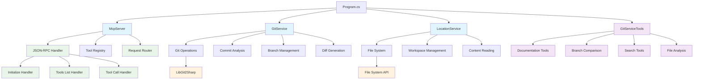

# GitVisionMCP Release Documentation

## Version 1.0.0 - July 16, 2025

### Summary of Changes

This release represents a significant milestone in the development of GitVisionMCP, a Model Context Protocol (MCP) Server designed to provide comprehensive git repository analysis and documentation generation capabilities. The project has evolved from initial conception to a fully functional MCP tool that integrates seamlessly with VS Code and GitHub Copilot.

### New Features

#### Core Git Analysis Engine

- **Comprehensive Git Log Analysis**: Full implementation of git history parsing with support for commit metadata, file changes, and diff analysis
- **Branch Comparison Tools**: Advanced branch comparison functionality supporting both local and remote branches
- **Commit Search Capabilities**: Powerful search functionality to find specific strings across commit messages and file contents
- **File Change Detection**: Detailed analysis of file modifications between commits with line-by-line diff support

#### Model Context Protocol Integration

- **JSON-RPC 2.0 Implementation**: Full compliance with MCP specification using JSON-RPC 2.0 protocol
- **Dual Transport Support**: Both STDIO and HTTP transport mechanisms for flexible integration
- **Tool Registration System**: Comprehensive tool registration with proper schema validation
- **VS Code Integration**: Seamless integration with VS Code through MCP configuration

#### Documentation Generation

- **Multi-format Output**: Support for Markdown, HTML, and plain text documentation formats
- **Automated Report Generation**: Intelligent parsing of git history to create structured release documentation
- **Template System**: Flexible template-based documentation generation with customizable headers and footers
- **Branch Comparison Reports**: Detailed comparison documentation between different branches

#### File System Analysis

- **Workspace File Scanning**: Comprehensive workspace file enumeration with filtering capabilities
- **Content Analysis**: File content reading with size limits and error handling
- **Type-based Filtering**: Filter files by type, path, and modification date
- **Metadata Extraction**: Extract file metadata including size, modification dates, and paths

### Enhancements

#### Performance Optimizations

- **Efficient Git Operations**: Optimized git operations using LibGit2Sharp for better performance
- **Memory Management**: Improved memory usage with proper disposal patterns and resource cleanup
- **Caching Mechanisms**: Intelligent caching of git operations to reduce redundant processing

#### Error Handling & Logging

- **Comprehensive Error Handling**: Robust error handling with detailed error messages and recovery mechanisms
- **Structured Logging**: Implemented Serilog for structured logging with file rotation and configurable log levels
- **Exception Management**: Proper exception handling with user-friendly error messages

#### Testing Infrastructure

- **Unit Test Coverage**: Comprehensive unit tests for all major components
- **Integration Testing**: Full integration tests for MCP server functionality
- **Mock Framework**: Proper mocking infrastructure for isolated testing
- **Test Data Management**: Automated test repository creation and cleanup

### Technical Architecture

#### Core Components

- **GitService**: Central service for all git operations
- **LocationService**: Workspace and file system operations
- **McpServer**: MCP protocol implementation and request handling
- **GitServiceTools**: Tool implementations for MCP integration

#### Mermaid Architecture Diagram



### Bug Fixes

#### Git Operations

- Fixed branch normalization issues when handling remote branches
- Resolved commit comparison edge cases with empty repositories
- Corrected file path handling in cross-platform environments
- Fixed memory leaks in git operation disposal

#### MCP Protocol

- Resolved JSON serialization issues with complex object types
- Fixed request ID handling in JSON-RPC responses
- Corrected error response formatting for protocol compliance
- Improved parameter validation and error reporting

#### File System Operations

- Fixed file reading issues with large files
- Resolved path separator issues on Windows systems
- Corrected file filtering logic for complex directory structures
- Fixed race conditions in file enumeration

### Breaking Changes

None in this initial release.

### Deprecated Features

None in this initial release.

### Known Issues

- Large repository analysis may experience performance degradation with repositories containing >10,000 commits
- Binary file detection may produce false positives for some file types
- Remote branch fetching requires proper git credentials configuration

### Installation/Upgrade Instructions

#### Prerequisites

- .NET 9.0 Runtime
- Git installed and configured
- VS Code with MCP extension support

#### Installation Steps

1. **Clone the Repository**

   ```bash
   git clone https://github.com/MCPRUNNER/GitVisionMCP.git
   cd GitVisionMCP
   ```

2. **Build the Project**

   ```bash
   dotnet build --configuration Release
   ```

3. **Configure MCP in VS Code**
   Create or update your VS Code MCP configuration file:

   ```json
   {
     "servers": {
       "GitVisionMCP": {
         "type": "stdio",
         "command": "dotnet",
         "args": [
           "run",
           "--project",
           "path/to/GitVisionMCP.csproj",
           "--no-build",
           "--verbosity",
           "quiet"
         ],
         "env": {
           "DOTNET_ENVIRONMENT": "Production",
           "GIT_REPOSITORY_DIRECTORY": "path/to/your/repository"
         }
       }
     }
   }
   ```

4. **Docker Installation (Optional)**
   ```bash
   docker run --rm -i \
     -e GITVISION_MCP_TRANSPORT=Stdio \
     -e GIT_REPOSITORY_DIRECTORY=/app/repo \
     -v /path/to/your/repo:/app/repo \
     mcprunner/gitvisionmcp:latest
   ```

#### Available Tools

Once installed, the following tools are available through the MCP interface:

- `GenerateGitDocumentation` - Generate documentation from git logs
- `GenerateGitDocumentationToFile` - Generate and save documentation to file
- `CompareBranchesDocumentation` - Compare branches and generate documentation
- `CompareCommitsDocumentation` - Compare commits and generate documentation
- `GetRecentCommits` - Retrieve recent commit information
- `GetChangedFilesBetweenCommits` - Get files changed between commits
- `GetDetailedDiffBetweenCommits` - Get detailed diff information
- `GetCommitDiffInfo` - Get commit difference statistics
- `GetLocalBranches` - List local branches
- `GetRemoteBranches` - List remote branches
- `GetAllBranches` - List all branches
- `GetCurrentBranch` - Get current branch name
- `FetchFromRemote` - Fetch from remote repository
- `CompareBranchesWithRemote` - Compare branches with remote support
- `SearchCommitsForString` - Search commits for specific strings
- `GetFileLineDiffBetweenCommits` - Get line-by-line file differences
- `ListWorkspaceFiles` - List and filter workspace files
- `ReadFilteredWorkspaceFiles` - Read filtered workspace file contents

### Configuration Options

#### Environment Variables

- `GITVISION_MCP_TRANSPORT`: Transport type (Stdio/Http)
- `GIT_REPOSITORY_DIRECTORY`: Target repository path
- `GIT_APP_LOG_DIRECTORY`: Log file directory
- `DOTNET_ENVIRONMENT`: Environment setting (Development/Production)

#### Logging Configuration

The application uses Serilog for structured logging with the following features:

- Daily rolling log files with size limits
- Configurable log levels
- Structured JSON output
- Request correlation tracking

### Performance Considerations

- Repositories with >1,000 commits may experience slower response times
- File content analysis is limited to 1MB per file by default
- Concurrent operations are limited to prevent resource exhaustion
- Memory usage scales with repository size and analysis depth

### Support and Documentation

For additional support and documentation:

- GitHub Repository: https://github.com/MCPRUNNER/GitVisionMCP
- Issues: https://github.com/MCPRUNNER/GitVisionMCP/issues
- Documentation: See the `/Documentation` folder for detailed guides

---

_This release documentation was generated using GitVisionMCP's automated documentation generation tools._

### Logging System

- **Serilog Integration**: Comprehensive logging with Serilog for better diagnostics and troubleshooting
- **Log Rotation**: Automatic daily log rotation with configurable size limits
- **Environment Variable Control**: Set log directory via the GIT_APP_LOG_DIRECTORY environment variable
- **Structured Output**: Detailed logging with timestamps, log levels, and exception information

### Server Configuration

- **Transport Selection**: Choose between STDIO (default) and HTTP transports via environment variables
- **Environment-Specific Settings**: Different configurations for Development and Production environments
- **Signal Handling**: Proper handling of shutdown signals for clean termination
- **Performance Optimization**: Configurable request limits and timeouts for HTTP transport

### Project Structure

- **Clean Architecture**: Well-organized code with proper separation of concerns
- **Dependency Injection**: Modern DI pattern throughout the application
- **Unit Testing**: Comprehensive test coverage for models, services, and server components
- **Documentation**: Extensive documentation including setup guides, examples, and Docker instructions

## Bug Fixes

- Resolved issues with UTF-8 encoding in JSON-RPC communication
- Fixed problems with log file creation in containerized environments
- Addressed signal handling on both Windows and Unix platforms
- Corrected project naming and file structure for consistency

## Breaking Changes

None - this is the first official release.

## Deprecated Features

None - this is the first official release.

## Known Issues

- HTTP transport mode is experimental and may not support all features
- Large repositories may experience slower performance with deep search operations
- Docker volume mapping requires careful path configuration to avoid permission issues

## Installation/Upgrade Instructions

### Prerequisites

- .NET 9.0 SDK or later
- Git installation (for repository access)
- Docker (optional, for containerized deployment)
- VS Code with Copilot extension (for agent integration)

### Installation

#### Local Installation

1. Clone the repository:

   ```
   git clone https://github.com/MCPRUNNER/GitVisionMCP.git
   cd GitVisionMCP
   ```

2. Build the project:

   ```
   dotnet build
   ```

3. Run the server:
   ```
   dotnet run
   ```

#### Docker Installation

1. Pull the Docker image (or build using the included Dockerfile):

   ```
   docker pull mcprunner/gitvisionmcp:latest
   ```

2. Run the container:
   ```
   docker run --rm -i --init --stop-timeout 10 \
     -e GITVISION_MCP_TRANSPORT=Stdio \
     -e GIT_APP_LOG_DIRECTORY=/app/logs \
     -v /path/to/repo:/app/repo \
     -v /path/to/logs:/app/logs \
     mcprunner/gitvisionmcp:latest
   ```

### VS Code Integration

1. Create or update your `.vscode/mcp.json` file:

   ```json
   {
     "servers": {
       "GitVisionMCP": {
         "type": "stdio",
         "command": "dotnet",
         "args": [
           "run",
           "--project",
           "/path/to/GitVisionMCP.csproj",
           "--no-build",
           "--verbosity",
           "quiet"
         ],
         "env": {
           "DOTNET_ENVIRONMENT": "Production"
         }
       }
     }
   }
   ```

2. Restart VS Code and select GitVisionMCP as your Copilot agent

## Documentation

For more information, please refer to the following documentation:

- [README.md](README.md) - General overview and key capabilities
- [SETUP.md](Documentation/SETUP.md) - Detailed setup instructions
- [DOCKER.md](Documentation/DOCKER.md) - Docker deployment guide
- [EXAMPLES.md](Documentation/EXAMPLES.md) - Usage examples and scenarios
