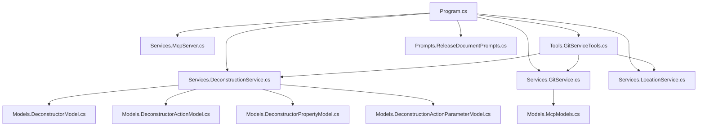

# GitVisionMCP (1.0.6) Release Documentation

## Version and Release Date

- **Application Name:** GitVisionMCP
- **Version:** 1.0.6
- **Release Date:** July 27, 2025
- **Current Branch:** search_csv

---

## Summary of Changes

This release introduces the new SearchCsvFile tool for advanced CSV querying, refines documentation generation, and maintains robust deconstruction features for C# services, repositories, and controllers. No differences were found between the `search_csv` and `master` branches.

---

## New Features

- **CSV File Search:**

  - Search for CSV values in a CSV file using JSONPath queries for advanced data extraction and filtering.

- **Deconstruction Tools:**

  - Deconstruct C# Service, Repository, or Controller files and output their structure as JSON.
  - Save deconstruction analysis directly to a JSON file in the workspace.

- **Branch and Commit Comparison:**

  - Compare branches and commits, generating documentation in markdown, HTML, or text formats.
  - Support for remote branch comparison with optional fetch.

- **Workspace File Analysis:**

  - List and filter workspace files by type, path, and modification date.
  - Read contents of filtered files, with binary and size checks.

- **Sampling LLM Integration:**
  - Run sampling chat using predefined user and system prompts.

---

## Enhancements

- Improved error handling and logging across all MCP tools.
- Output format validation for documentation generation.
- Directory existence checks before file operations.
- Enhanced filtering and performance for workspace file listing.

---

## Bug Fixes

- Fixed issues with file not found and binary file detection.
- Improved robustness in commit and branch comparison tools.
- Addressed edge cases in workspace file filtering and reading.

---

## Breaking Changes

- None reported for this release.

---

## Deprecated Features

- None reported for this release.

---

## Known Issues

- Large binary files are skipped in workspace file reading.
- Some edge cases in file filtering may require manual review.

---

## Installation/Upgrade Instructions

1. Ensure you are in a valid git repository.
2. Use the provided `mcp.json` configuration for VS Code Copilot Agent integration.
3. Build the project using:
   ```
   dotnet build
   ```
4. Run the MCP server with:
   ```
   dotnet run --project c:\Users\U00001\source\repos\MCP\GitVisionMCP\GitVisionMCP.csproj --no-build --verbosity quiet
   ```
5. For Docker, use the configuration in `.vscode/mcp.json`.

---

## MCP Tools Available in This Release

| Tool Name                             | Description                                                                   |
| ------------------------------------- | ----------------------------------------------------------------------------- |
| FetchFromRemoteAsync                  | Fetch latest changes from remote repository                                   |
| GenerateGitDocumentationAsync         | Generate documentation from git logs for the current workspace                |
| GenerateGitDocumentationToFileAsync   | Generate documentation from git logs and write to a file                      |
| CompareBranchesDocumentationAsync     | Generate documentation comparing differences between two branches             |
| CompareBranchesWithRemote             | Generate documentation comparing differences between two branches with remote |
| CompareCommitsDocumentation           | Generate documentation comparing differences between two commits              |
| GetRecentCommitsAsync                 | Get recent commits from the current repository                                |
| GetLocalBranchesAsync                 | Get list of local branches in the repository                                  |
| GetRemoteBranchesAsync                | Get list of remote branches in the repository                                 |
| GetAllBranchesAsync                   | Get list of all branches (local and remote) in the repository                 |
| GetCurrentBranchAsync                 | Get the current active branch in the repository                               |
| GetChangedFilesBetweenCommits         | Get list of files changed between two commits                                 |
| GetCommitDiffInfo                     | Get comprehensive diff information between two commits                        |
| GetDetailedDiffBetweenCommits         | Get detailed diff content between two commits                                 |
| SearchCommitsForStringAsync           | Search all commits for a specific string                                      |
| GetFileLineDiffBetweenCommits         | Get line-by-line file diff between two commits                                |
| ListWorkspaceFilesAsync               | List all files in the workspace with optional filtering                       |
| ListWorkspaceFilesWithCachedDataAsync | List workspace files with optional filtering using cached data                |
| ReadFilteredWorkspaceFilesAsync       | Read contents of all files from filtered workspace results                    |
| SearchJsonFileAsync                   | Search for JSON values in a JSON file using JSONPath                          |
| SearchXmlFileAsync                    | Search for XML values in an XML file using XPath                              |
| TransformXmlWithXsltAsync             | Transform an XML file using an XSLT stylesheet                                |
| SearchYamlFileAsync                   | Search for YAML values in a YAML file using JSONPath                          |
| SearchCsvFileAsync                    | Search for CSV values in a CSV file using JSONPath                            |
| DeconstructAsync                      | Deconstruct a C# Service, Repository or Controller file as JSON               |
| DeconstructToJsonAsync                | Deconstruct a C# file and save structure to a JSON file                       |
| SamplingLLM                           | Run Sampling chat to process predefined User and System prompts               |

---

## Workspace Architecture (Mermaid Flowchart)



---

No differences found between branches search_csv and master.
