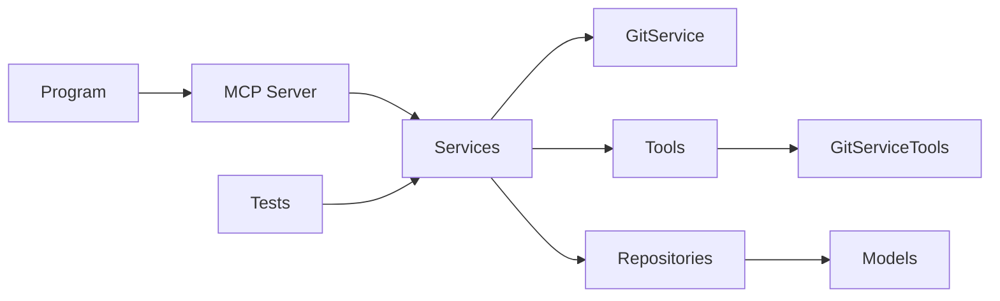

# Release Document

Version: 1.0.8.2

Release Date: 2025-08-17

## Summary

This release collects development work since the previous release. It includes new tooling, improved documentation, extended git/remote support, tests, and internal refactors to centralize git operations into a common tools library. The changes aim to make the MCP server more robust when interacting with remote repositories and easier to maintain.

## Highlights

New Features

- Added tests and test projects to improve CI coverage (GitVisionMCP.Tests).
- Added Docker support and Dockerfile to enable containerized runs.
- Added system prompts and release document prompts to standardize documentation generation.

Enhancements

- Introduced Serilog-based logging and log directory configuration.
- Improved commit/line-diff tooling and added line-numbering to diffs.
- Added remote repository capabilities and extended comparison tools.
- Added documentation improvements across SETUP, EXAMPLES, and other docs.

Bug Fixes

- Fixed STDIO JSON output cleanup and remote fetch fallbacks for environments without git in PATH.
- Documentation fixes and addition of RELEASE_DOCUMENT.md and related prompts.

Breaking Changes

- Removed the old Handler MCP and migrated to a common GitServiceTools (see Tools/GitServiceTools.cs). Consumers of the removed Handler MCP will need to adapt to the new GitServiceTools API/usage. (refer to commit 095a09d1)

Deprecated

- No explicit deprecations beyond the handler removal noted above.

Known Issues

- None listed in the commit history for this release. If you encounter runtime differences after migrating to GitServiceTools, please open an issue with the stack trace and sample repro.

Notable Commits (representative)

- 2cc414d3 — Merge prompt.v2 and add release notes prompts and tooling
- 42781a99 — Docker support and project updates
- 521286fa — Serilog added and logging improvements
- c6ac3229 — Fixed Git Fetch issues by adding https PAT and git exe fallback
- 095a09d1 — Removed Handler MCP and migrated to common GitServiceTools (breaking)

Tools & Files of Interest

- Program.cs — application entrypoint and configuration wiring
- Services/McpServer.cs — MCP JSON-RPC server implementation
- Services/GitService.cs — git operations wrapper
- Tools/GitServiceTools.cs — centralized git/remote helpers (new)
- MD/COMMIT_REPORT.md — full generated commit report used to create this document

Architecture Summary (mermaid)

## Architecture diagram

See the generated component diagram describing the runtime DI wiring and major services/tools: `MD/mermaid_segment_1.md`.

## Install / Upgrade Notes

1. Prerequisites

   - .NET 8/9 SDK (as used by the project). Ensure `dotnet --version` matches the CI/runtime requirements.
   - git installed and available in PATH for full remote operations. The code includes fallbacks but local git is recommended.

2. Build

   - From the repo root run: `dotnet build` (or use the provided VS Code build task).

3. Run tests

   - `dotnet test` from the solution root will run the test projects added in this release.

4. Upgrade steps for Handler MCP users
   - Replace usages of the removed Handler MCP with calls to Tools/GitServiceTools or Services/GitService.
   - Review calls that relied on the old STDIO-based handler and migrate to the unified GitServiceTools methods.

## Verification / Smoke Checks

- Build the solution: `dotnet build`.
- Run unit tests: `dotnet test`.
- Generate a commit report using the included tools to validate git/remote behavior.

## Notes

This document was assembled automatically from the repository commit history and source layout. For a full list of commits, see `MD/COMMIT_REPORT.md`.

If you'd like a longer, detailed changelog with per-commit descriptions or a more detailed mermaid diagram showing class-level relationships, tell me which area to expand and I will generate it in smaller chunks to avoid large outputs.

Generated-by: GitVisionMCP tooling
