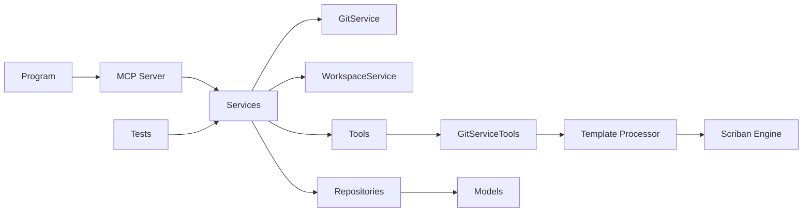
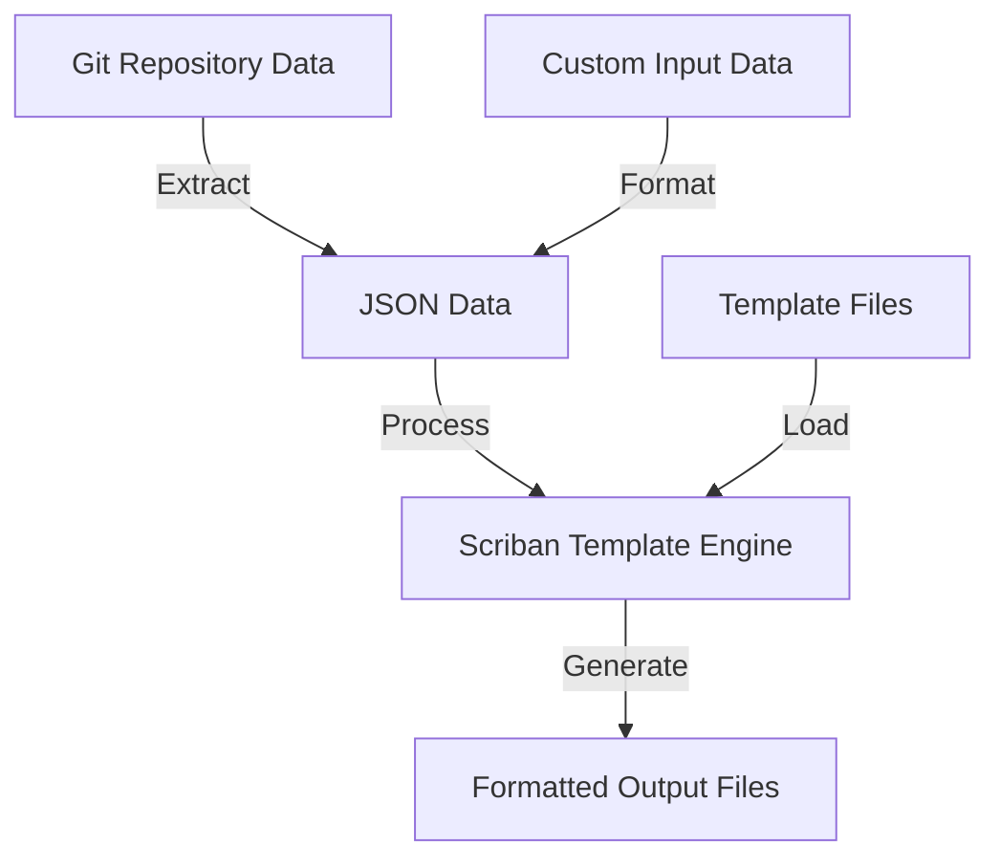

# GitVisionMCP Release Document

Version: 1.0.9.1

Release Date: 2025-08-24

## Summary

This release introduces Scriban/JINJA template processing capabilities to GitVisionMCP, allowing for more flexible and powerful documentation generation. It builds upon the previous release which included new tooling, improved documentation, extended git/remote support, tests, and internal refactors to centralize git operations into a common tools library. The changes aim to make the MCP server more robust when interacting with remote repositories, easier to maintain, and more powerful for generating documentation.

## Highlights

### New Features

- **Scriban/JINJA Template Processing**: Added template processing support with Scriban/JINJA syntax for generating rich documentation from git data
- **Template Examples**: Added example templates under `.github/templates/` directory to demonstrate template functionality
- **New Tool - gv_run_sbn_template**: Implemented new tool to execute templates with JSON data and output to specified files

### Previous Release Features

- Tests and test projects to improve CI coverage (GitVisionMCP.Tests)
- Docker support and Dockerfile to enable containerized runs
- System prompts and release document prompts to standardize documentation generation

### Enhancements

- **Template Processing Configuration**: Updated `.gitvision/config.json` to support template processing features
- **JSON Data Transformation**: Added functionality to transform git data into structured JSON for template processing
- Improved documentation with examples for using the template system

### Previous Release Enhancements

- Serilog-based logging and log directory configuration
- Improved commit/line-diff tooling and added line-numbering to diffs
- Remote repository capabilities and extended comparison tools
- Documentation improvements across SETUP, EXAMPLES, and other docs

### Bug Fixes

- No specific bug fixes in this release

### Previous Release Bug Fixes

- Fixed STDIO JSON output cleanup and remote fetch fallbacks for environments without git in PATH
- Documentation fixes and addition of RELEASE_DOCUMENT.md and related prompts

### Breaking Changes

- None in this release

### Previous Breaking Changes

- Removed the old Handler MCP and migrated to a common GitServiceTools (see Tools/GitServiceTools.cs). Consumers of the removed Handler MCP will need to adapt to the new GitServiceTools API/usage. (refer to commit 095a09d1)

### Deprecated

- No explicit deprecations in this release

### Known Issues

- None listed in the commit history for this release

### Notable Commits

#### Current Release

- 5f3dc69e — Merge pull request #48 from MCPRUNNER/scriban_tools - Scriban tools
- 1c0f1ef0 — Adding Scriban/JINJA template processing, with example templates under .github/templates/
- 5286f8b7 — Adding .github/prompts/document.commits.prompt.md as an example prompt for running gv_run_sbn_template

#### Previous Release

- 2cc414d3 — Merge prompt.v2 and add release notes prompts and tooling
- 42781a99 — Docker support and project updates
- 521286fa — Serilog added and logging improvements
- c6ac3229 — Fixed Git Fetch issues by adding https PAT and git exe fallback
- 095a09d1 — Removed Handler MCP and migrated to common GitServiceTools (breaking)

### Tools & Files of Interest

#### New/Modified Files in This Release

- `.github/templates/commit.template.sbn` — Example Scriban template for commit formatting
- `.github/templates/commit2.template.sbn` — Alternative template with different formatting
- `.github/prompts/document.commits.prompt.md` — Example prompt for running template tools
- `Tools/GitServiceTools.cs` — Updated with template processing capabilities
- `Services/WorkspaceService.cs` — Enhanced to support template operations
- `test-sbn-data.json` — Sample JSON data for template testing

#### Key Files from Previous Release

- `Program.cs` — Application entrypoint and configuration wiring
- `Services/McpServer.cs` — MCP JSON-RPC server implementation
- `Services/GitService.cs` — Git operations wrapper
- `Tools/GitServiceTools.cs` — Centralized git/remote helpers
- `MD/COMMIT_REPORT.md` — Full generated commit report used to create this document

### Architecture Summary (mermaid)



## Architecture diagram

The diagram above shows the updated architecture with the new template processing components. The WorkspaceService has been enhanced to work with the template processor, which uses the Scriban Engine to transform JSON data into formatted documentation.

## API Documentation

### New Tool: gv_run_sbn_template

This tool runs a Scriban, Jinja, or Jinja2 template with provided input data.

**Parameters:**

- `templateFilePath` (required): Path to the Scriban (Jinja or Jinja2) Template file relative to workspace root
- `jsonData` (required): JSON input string data for the template
- `outputFilePath` (required): Path to the output file relative to workspace root

**Example Usage:**

```json
{
  "templateFilePath": ".github/templates/commit.template.sbn",
  "jsonData": "{\"commits\": [...]}",
  "outputFilePath": "output/commit-report.md"
}
```

### Template Syntax Examples

The Scriban/JINJA templates support a rich syntax for data transformation. Here's a basic example from one of the included templates:

```
# {{ title }}

Generated on: {{ date.now | date.to_string '%Y-%m-%d %H:%M:%S' }}
{{~ if commits ~}}
Total commits: {{ commits | array.size }}

{{~ for commit in commits ~}}
## Commit: {{ commit.sha }}

**Author:** {{ commit.author_name }} <{{ commit.author_email }}>
**Date:** {{ commit.date | date.to_string '%Y-%m-%d %H:%M:%S' }}

**Message:**
```

{{ commit.message }}

```

**Changed Files:**
{{~ for file in commit.files ~}}
- {{ file.path }}
{{~ end ~}}

**Changes:**
{{~ for file in commit.files ~}}
- {{ file.change_type }}: {{ file.path }}
{{~ end ~}}

---

{{~ end ~}}
{{~ end ~}}
```

## Install / Upgrade Notes

1. Prerequisites

   - .NET 8/9 SDK (as used by the project). Ensure `dotnet --version` matches the CI/runtime requirements.
   - git installed and available in PATH for full remote operations. The code includes fallbacks but local git is recommended.

2. Build

   - From the repo root run: `dotnet build` (or use the provided VS Code build task).

3. Run tests

   - `dotnet test` from the solution root will run the test projects added in this release.

4. Using Templates
   - Place template files in your workspace (e.g., in a `.github/templates/` directory)
   - Create JSON data or use the git tools to generate it
   - Use the `gv_run_sbn_template` tool to process templates with your data
   - Templates use Scriban/JINJA syntax to transform the data

## Verification / Smoke Checks

- Build the solution: `dotnet build`
- Run unit tests: `dotnet test`
- Test template processing:
  1. Create a simple template file
  2. Prepare JSON data or use git tools to generate it
  3. Use `gv_run_sbn_template` to process the template
  4. Verify the output file contains the expected formatted content

## Notes

### Using Templates for Documentation Generation

The new Scriban/JINJA template processing feature is particularly useful for:

1. Generating release notes from commit history
2. Creating documentation from code structure
3. Transforming complex JSON data into readable formats
4. Building custom reports from git operations

### Template Processing Flow



### Future Enhancements

- Additional template helper functions for complex transformations
- Support for more template formats and engines
- Template caching for improved performance
- Template composition and inheritance

This document was assembled automatically from the repository commit history and source layout. For a full list of commits, see `MD/BRANCH_COMPARISON.md`.

Generated by: GitVisionMCP tooling using the new template processing capabilities
